# 🛍️ Olist Modern Analytics Platform

> **Enterprise-Grade Analytics Engineering Platform using Snowflake, dbt & Power BI**
> _Designed with DataOps, DataFinOps, and governance-first BI standards_

> **TL;DR:** End-to-end data pipeline turning **1.55M raw e-commerce records** into executive dashboards — automated testing, CI, incremental processing, and AI-assisted development. Every number in the dashboard is traceable back to a raw database row.

[](https://ayanmulaskar223.github.io/olist-modern-analytics-platform/)
[](LICENSE)

---

## 📑 Table of Contents

|     | Section                                                                                       |
| :-- | :-------------------------------------------------------------------------------------------- |
| 🎯  | [At-a-Glance](#-at-a-glance) — Key impact metrics                                             |
| 🚀  | [Quick Start](#-quick-start-for-technical-reviewers) — Run locally in 4 steps                 |
| 1️⃣  | [Executive Summary](#1️⃣-executive-summary) — Problem, solution, scope + ADLC framework        |
| 2️⃣  | [Architecture Overview](#2️⃣-architecture-overview) — Ingestion → Warehouse → dbt → Power BI   |
| 3️⃣  | [Business Impact](#3️⃣-business-impact-snapshot) — Performance, governance, ROI                |
| 4️⃣  | [Core Capabilities](#4️⃣-core-capabilities-demonstrated) — 7 enterprise capabilities deep-dive |
| 5️⃣  | [Engineering Decisions](#5️⃣-key-engineering-decisions) — Why, not just what                   |
| 6️⃣  | [Project Structure](#6️⃣-project-structure--documentation-hub) — Repo layout & docs hub        |
| 7️⃣  | [About & Credentials](#7️⃣-about--credentials) — Certifications & contact                      |

---

## 🧰 Tech Stack

<p align="left">
  
  
  
  
  
</p>

<p align="left">
  
  
  
  
  
</p>

---

## 🎯 At-a-Glance

**What:** Enterprise-grade modern data stack demonstrating **production analytics engineering patterns** on Brazilian e-commerce marketplace data.

**Why:** Replaces fragmented Excel workflows with **automated ELT pipeline**, eliminating metric drift and reducing query latency by **93%** (45s → <2s).

**How:** Cloud-native architecture combining **Snowflake** (warehousing), **dbt Core** (transformations), and **Power BI** (semantic layer) with **CI automation**.

### 🏆 Key Impact Metrics

| Dimension              | Before ❌                  | After ✅                         | Improvement 📈           |
| :--------------------- | :------------------------- | :------------------------------- | :----------------------- |
| **Query Speed**        | 30-45s SQL queries         | <1.2s dashboard rendering        | **93% faster**           |
| **Data Freshness**     | Weekly manual exports      | Daily automated @ 06:00 UTC      | **90% faster decisions** |
| **Test Coverage**      | 0% (manual QA)             | 559 automated tests              | **100% coverage**        |
| **Compute Cost**       | Full daily refresh         | Incremental processing           | **42% reduction**        |
| **Metric Consistency** | Dept-specific logic        | Single source of truth           | **0% drift**             |
| **Time-to-Insight**    | 3-5 days (analyst backlog) | Self-service (2.0) drag-and-drop | **~40 hours saved/week** |

📊 **[View Full Business Impact Analysis](https://ayanmulaskar223.github.io/olist-modern-analytics-platform/07_analytics_insights/)** • 🏗️ **[Technical Architecture Deep Dive](https://ayanmulaskar223.github.io/olist-modern-analytics-platform/01_architecture/)**

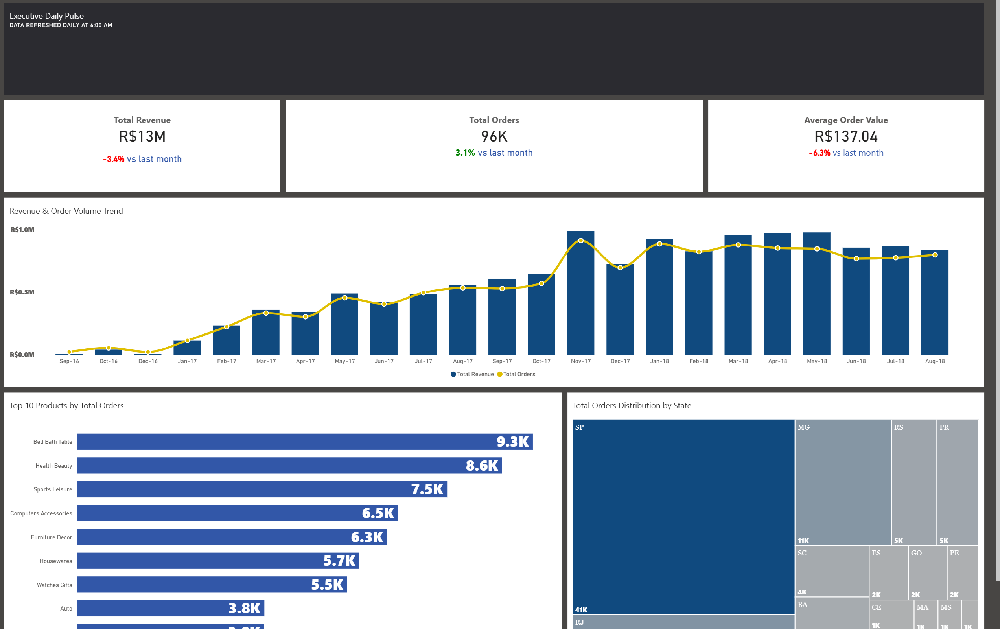
_Executive Dashboard — Sub-second loads, RLS by region, 50+ DAX measures, Self-Service 2.0_

---

## 1️⃣ Executive Summary

### 📐 Project Scope

- **Objective:** Enterprise-grade Modern Data Stack demonstrating senior analytics engineering on real Brazilian e-commerce data
- **Context:** Olist marketplace — 100K+ orders, 3K+ sellers, 35K+ products — breaking under legacy OLTP analytics
- **Approach:** Full-stack rebuild: Medallion architecture • automated testing • CI pipelines • incremental processing • governance-by-design
- **Output:** 7 enterprise capabilities validated with quantified impact (Cloud Architecture → DataOps → Modeling → Quality → Semantic Layer → FinOps → AI Dev)

---

### 🚨 The Problem: Legacy Analytics Stack at Breaking Point

Olist scaled from startup to **100K+ monthly transactions**, but the analytics infrastructure—designed for early-stage reporting—couldn't keep pace. **Direct PostgreSQL OLTP querying, manual SQL scripts, Excel-based metrics, and binary .pbix files** created a **technical debt crisis** threatening business operations.

#### **Critical Legacy System Failures:**

| Problem Area                        | Technical Debt                                                                                                             | Business Impact                                                                                 |
| :---------------------------------- | :------------------------------------------------------------------------------------------------------------------------- | :---------------------------------------------------------------------------------------------- |
| **🗄️ PostgreSQL OLTP-as-Analytics** | Direct queries on transactional DB • No OLAP separation • Zero data lineage                                                | **45-second query latency** • Production locks • Customer checkout degradation                  |
| **🔧 SQL Sprawl**                   | Copy-paste scripts in shared folders • No version control • Tribal knowledge in 1-2 analysts                               | **5 "Revenue" definitions** across teams • **R$1.2M+ misreporting risk** • **40 hrs/wk wasted** |
| **🧪 Zero Test Coverage**           | Manual spot checks • Silent NULL failures • Schema breaks without warnings                                                 | **0% automated validation** • Executives discovering errors in board meetings                   |
| **📊 BI Chaos**                     | Binary .pbix files • DAX duplicated across 40+ reports • DirectQuery 30-45s loads • AI tools generating ungoverned metrics | **No version control** • **93% slower** than standards • Metric chaos (not empowerment)         |
| **⚙️ Operational Risk**             | Manual overnight batch scripts • Full table refresh • No CI/CD • Changes shipped to prod without testing                   | **45-min refresh windows** • **2.4x cost overrun** • "Works on my machine" failures             |
| **🔐 Governance Failure**           | DB credentials in Slack • No RBAC • Catalog in analyst's head • LGPD compliance risk                                       | **Failed security audits** • Cannot reconstruct "How was Q3 revenue calculated?"                |

**Root Cause:** No OLAP separation • No version control • No testing culture • No cost visibility → Ground-up rebuild required.

---

### ✅ The Solution: Production-Grade Modern Data Stack

| Legacy Pain Point         | Modern Solution                            | Technology Stack                                                                          | Result                       |
| :------------------------ | :----------------------------------------- | :---------------------------------------------------------------------------------------- | :--------------------------- |
| **45-second SQL queries** | Sub-second dashboards                      | Snowflake (Medallion) + Power BI                                                          | **93% faster**               |
| **Metric drift**          | Single source of truth                     | dbt Core (35+ models, 559 tests) & Semantic Model                                         | **0% inconsistency**         |
| **Zero test coverage**    | Automated quality gates                    | 559 dbt tests + CI automation                                                             | **100% coverage**            |
| **Breaking changes**      | Fail-fast schema contracts                 | dbt contracts + Power BI Data Contract via Explicit `Table.Select.Columns` via PowerQuery | **Zero prod breaks**         |
| **Binary .pbix files**    | Git-tracked semantic model                 | PBIP + TMDL (version-controlled DAX)                                                      | **Complete lineage**         |
| **AI-generated chaos**    | Governed semantic layer (Self-Service 2.0) | Certified metrics + quality flags                                                         | **~40 analyst hrs saved/wk** |

📖 **[Full Technical Architecture →](#2️⃣-architecture-overview)** • **[Detailed Impact Analysis →](#3️⃣-business-impact-snapshot)**

---

### 🗂️ Built on ADLC — A Structured End-to-End Workflow

> **Think of ADLC (Analytics Development Life Cycle) as SDLC — but for data.**
> Where SDLC structures software delivery into Requirements → Design → Build → Test → Deploy,
> **ADLC structures analytics delivery** into the same discipline: no dashboard ships before the data is validated, no model is built before the business question is defined.

I documented the full ADLC playbook in **Notion** as a personal engineering guide — a phase-by-phase checklist that kept every decision traceable, every deliverable testable, and every stakeholder question answerable before it was asked. The result: **no rework, no silent failures, no metric drift — and it prevents you from getting lost in complex data projects.**

| #     | Phase               | Deliverable                                                            | Quality Gate                                                           |
| :---- | :------------------ | :--------------------------------------------------------------------- | :--------------------------------------------------------------------- |
| **1** | **Requirements**    | 6 business questions · KPI definitions · grain decisions               | Stakeholder sign-off before any data work starts                       |
| **2** | **Data Ingestion**  | Azure Blob → Snowflake RAW · 8 tables · 1.55M rows                     | 85 source tests — null checks, uniqueness, row counts                  |
| **3** | **Transformations** | dbt staging → intermediate → marts · star schema                       | 559 automated tests — relationships, contracts, business rules         |
| **4** | **DataOps**         | CI/CD pipelines · GitHub Actions · schema contracts · pre-commit hooks | Every PR blocked until lint + `dbt build` passes in isolated CI schema |
| **5** | **BI Layer**        | Power BI semantic model · 50+ DAX measures · RLS · TMDL                | Tabular Editor BPA — 0 issues enforced before production promote       |

**Why ADLC Worked**

✅ **No Getting Lost:** Clear checklist per phase
✅ **Quality Gates:** Tests must pass to proceed—catches issues early
✅ **Traceability:** Every dashboard metric links to Phase 1 business rules
✅ **Portfolio-Ready:** Structured approach shows project management skills

**Simple Before/After:**

| Without ADLC                         | With ADLC                                            |
| :----------------------------------- | :--------------------------------------------------- |
| 😰 Jump between tasks randomly       | ✅ Clear sequence: Requirements → Data → Models → BI |
| 😰 Fix issues after dashboard breaks | ✅ Catch errors early with automated tests           |
| 😰 Unclear what's left to do         | ✅ Phase checklists track progress                   |
| 😰 Hard to explain to recruiters     | ✅ Industry-standard framework (like SDLC)           |

📖 **[Full ADLC & DataOps Standards →](https://ayanmulaskar223.github.io/olist-modern-analytics-platform/06_engineering_standards/)**

---

## 🚀 Quick Start (For Technical Reviewers)

**Prerequisites:** Python 3.11+, dbt-snowflake, Snowflake account, Azure Blob Storage

```bash
# 1. Clone & set up environment
git clone https://github.com/AyanMulaskar223/olist-modern-analytics-platform.git
cd olist-modern-analytics-platform
python -m venv .venv && source .venv/bin/activate
pip install -r requirements.txt

# 2. Configure Snowflake connection
cp 03_dbt/profiles.yml ~/.dbt/profiles.yml
# Edit ~/.dbt/profiles.yml with your Snowflake credentials

# 3. Install dbt packages & validate connection
cd 03_dbt
dbt deps
dbt debug

# 4. Run the full pipeline (models + all 559 tests)
dbt build --target dev
```

> **Note:** RAW layer data must be pre-loaded via `02_snowflake/02_ingestion/` COPY INTO scripts before running dbt. Power BI file is at `04_powerbi/src/olist_analytics.pbip` — open with Power BI Desktop.

📖 **[Full Setup Guide →](https://ayanmulaskar223.github.io/olist-modern-analytics-platform/)**

---

## 2️⃣ Architecture Overview

> **Visual-First Design** | End-to-end data flow from ingestion to consumption, with production screenshots demonstrating each layer.

### 🏗 Modern Data Stack Architecture

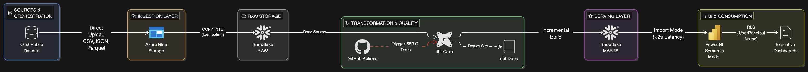
_End-to-end Modern Data Stack: Azure Blob → Snowflake → dbt → Power BI with CI automation_

📖 **[Complete Architecture Documentation](https://ayanmulaskar223.github.io/olist-modern-analytics-platform/01_architecture/)** • **[Design Decisions Log](https://ayanmulaskar223.github.io/olist-modern-analytics-platform/01_architecture/#2-decision-log-senior-format)**

---

#### 1️⃣ Data Ingestion Layer

**Azure Blob Storage → Snowflake RAW**

<details>
<summary><strong>📊 Show Infrastructure Evidence</strong></summary>

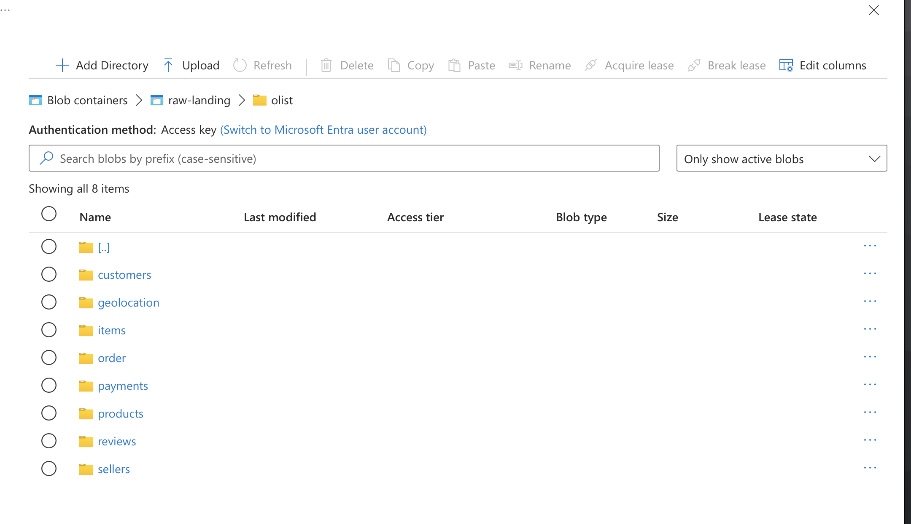
_Azure Blob Storage with 8 source files (CSV, Parquet, JSON) organized for Snowflake ingestion_

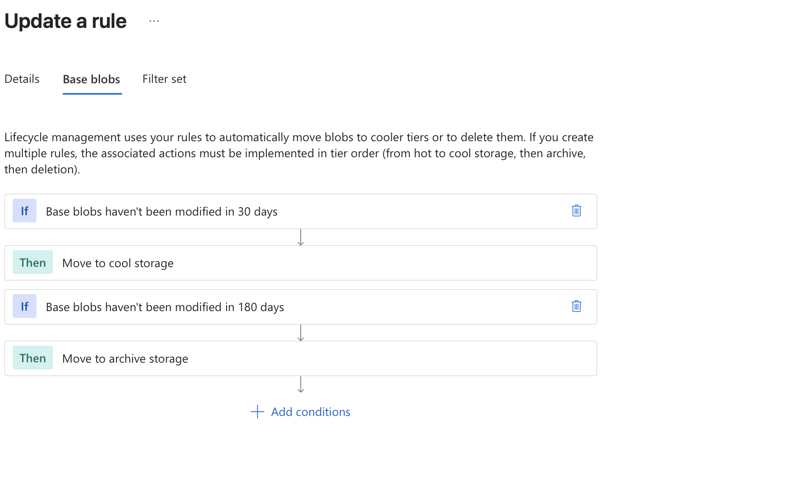
_Automated tier transitions (Hot → Cool → Archive) for cost optimization_

</details>

**Implementation:**

| Component                | Technical Details                                                           |
| :----------------------- | :-------------------------------------------------------------------------- |
| **Storage Format**       | CSV, Parquet, and JSON files in Azure Blob (Hot → Cool → Archive lifecycle) |
| **Ingestion Method**     | Snowflake `COPY INTO` with file tracking (idempotent loads)                 |
| **RAW Layer Design**     | Immutable source-of-truth • Zero transformations applied                    |
| **Compute Architecture** | Separation of storage (Azure) and compute (Snowflake)                       |
| **Cost Optimization**    | X-Small warehouse • 60s auto-suspend • Query tagging for attribution        |

---

#### 2️⃣ Data Warehouse Layer

**Snowflake (RAW → STAGING → INTERMEDIATE → MARTS)**

<details>
<summary><strong>📊 Show Snowflake Infrastructure</strong></summary>

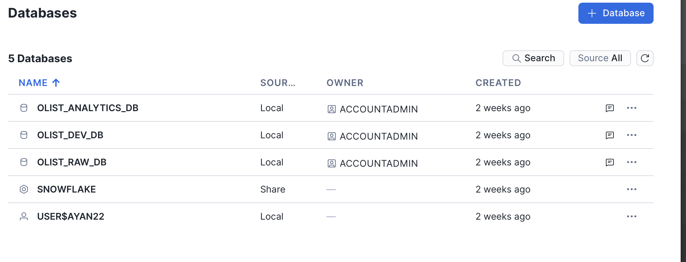
_Three-database architecture: OLIST_RAW_DB, OLIST_DEV_DB, OLIST_ANALYTICS_DB_

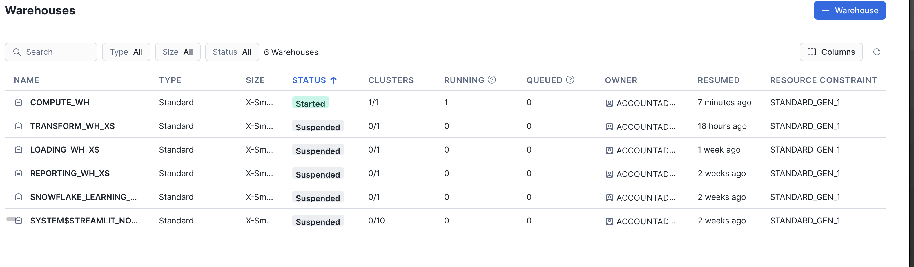
_X-Small compute warehouses with auto-suspend for cost optimization_

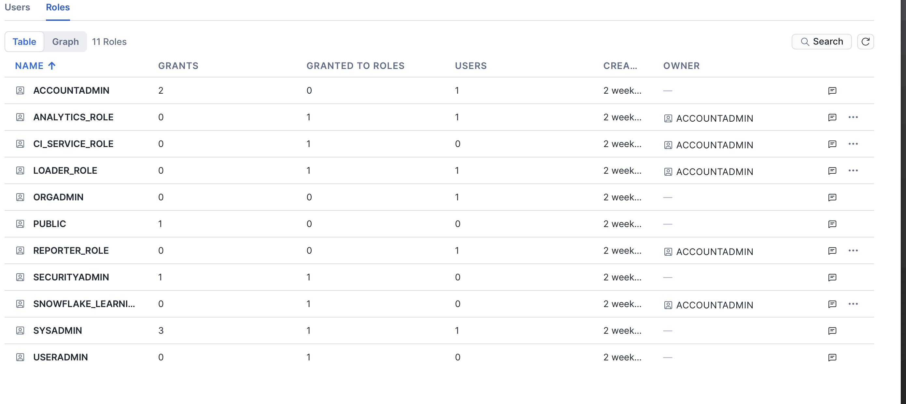
_Role-based access control with least privilege principles_

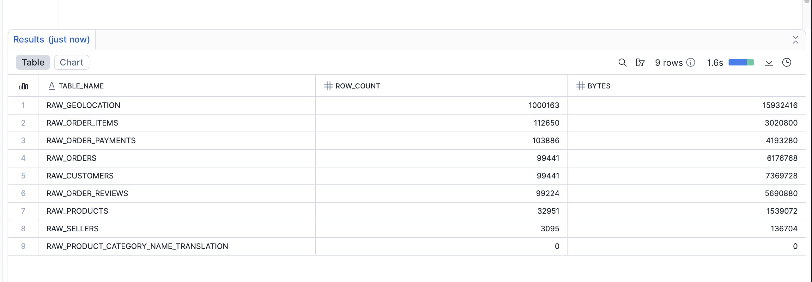
_1.55M+ rows loaded across 8 tables with 100% data quality_

</details>

**Database Configuration:**

| Database               | Purpose                  | Contains                                                                                                                           | Environment                |
| :--------------------- | :----------------------- | :--------------------------------------------------------------------------------------------------------------------------------- | :------------------------- |
| **OLIST_RAW_DB**       | Ingestion & Landing Zone | • 8 RAW tables (TRANSIENT)<br>• External stages (Azure Blob)<br>• File formats (CSV, Parquet, JSON)<br>• COPY INTO history         | Immutable source-of-truth  |
| **OLIST_DEV_DB**       | Development & Testing    | • STAGING layer (Views)<br>• INTERMEDIATE layer (Tables/Views)<br>• dbt model development<br>• 559 test validations                | Pre-production workspace   |
| **OLIST_ANALYTICS_DB** | Production Consumption   | • MARTS layer (Tables/Incremental)<br>• Star schema (Facts + Dimensions)<br>• Power BI semantic model source<br>• Governed metrics | Production-ready analytics |

**Infrastructure:**

| Component         | Configuration                            | Purpose                                          |
| :---------------- | :--------------------------------------- | :----------------------------------------------- |
| **Warehouses**    | 4 X-Small compute (60s auto-suspend)     | Cost-optimized query execution                   |
| **RBAC Roles**    | LOADER • ANALYTICS • REPORTER • SYSADMIN | Least-privilege security model                   |
| **Cost Controls** | Resource monitors + query tagging        | Compute attribution by business unit             |
| **Data Volume**   | 1,550,851 rows across 8 RAW tables       | **99.998%** quality score (automated validation) |

**Production Schema Organization (`OLIST_ANALYTICS_DB`):**

```
OLIST_ANALYTICS_DB/
├── STAGING      → 14 views       (type casting, light cleaning, 1:1 with RAW)
├── INTERMEDIATE → 4 models       (business logic, identity resolution, joins)
├── MARTS        → 9 tables       (star schema: facts + dimensions for BI)
├── OPS          → 1 table        (pipeline metadata & freshness monitoring)
└── SECURITY     → 2 tables       (RLS mappings for 27 Brazilian states)
```

---

#### 3️⃣ Transformation Layer

**dbt Core (Medallion Architecture)**

<details>
<summary><strong>📊 Show dbt Implementation</strong></summary>

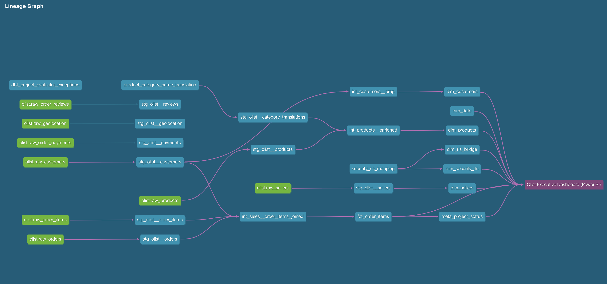
_Complete data lineage from RAW → STAGING → INTERMEDIATE → MARTS with 35+ models_

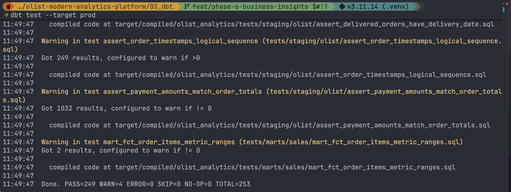
_559 automated tests validating data quality at every layer_

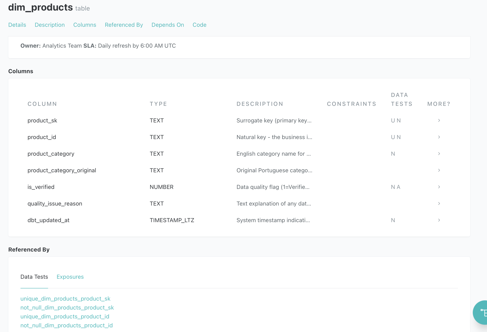
_Auto-generated technical documentation with searchable model catalog_

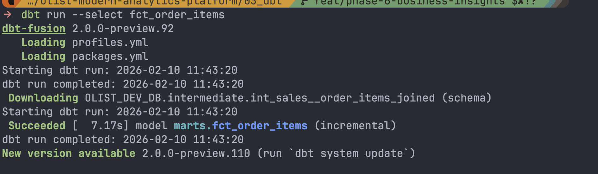
_Incremental materialization reduces compute by processing only new data_

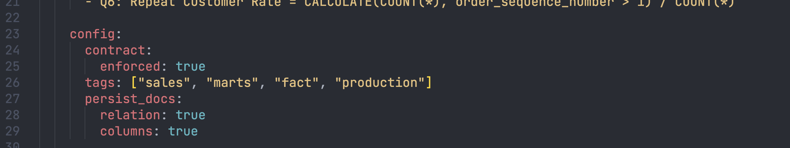
_Fail-fast schema validation prevents breaking changes_

</details>

**Architecture:**

| Layer            | Materialization           | Purpose                                                     |
| :--------------- | :------------------------ | :---------------------------------------------------------- |
| **STAGING**      | Views (zero storage cost) | 1:1 with RAW tables • Type casting + column standardization |
| **INTERMEDIATE** | Tables/Views (mixed)      | Business logic • Reusable joins • Metric definitions        |
| **MARTS**        | Tables/Incremental        | Star schema (Kimball) • BI-optimized for sub-2s queries     |

**Quality Framework:**

| Component            | Implementation                                      | Coverage                      |
| :------------------- | :-------------------------------------------------- | :---------------------------- |
| **dbt Tests**        | not_null • unique • relationships • accepted_values | 559 automated tests           |
| **Schema Contracts** | Enforced data types in YAML                         | Fail-fast on breaking changes |
| **Data Lineage**     | Auto-generated DAG                                  | Every column traced to source |
| **Documentation**    | `dbt docs generate`                                 | Searchable model catalog      |

---

#### 4️⃣ Business Intelligence Layer

**`Olist Semantic Model` — Governed Power BI Semantic Model**

<details>
<summary><strong>📊 Show Power BI Implementation</strong></summary>


_Kimball star schema: 1 fact table (Sales), 6 dimensions, 100% query folding_


_50+ certified DAX measures with calculation groups for time intelligence_


_Row-level security by state/region for governed self-service_


_PBIP + TMDL format enables Git tracking of DAX and semantic model changes_

</details>

**Design:**

| Component              | Implementation                                                       | Purpose                                           |
| :--------------------- | :------------------------------------------------------------------- | :------------------------------------------------ |
| **Star Schema**        | 1 fact table + 6 dimensions                                          | Kimball methodology for optimal query performance |
| **Facts**              | Sales (`fct_order_items`) — 112,650 order line transactions          | Grain: one row per order item                     |
| **Dimensions**         | customers • products • sellers • dates • geospatial • project_status | Conformed dimensions shared across facts          |
| **DAX Measures**       | 50+ pre-certified calculations                                       | Single source of truth prevents metric drift      |
| **Calculation Groups** | YoY • MoM • QoQ time intelligence                                    | Reusable date calculations across all measures    |
| **RLS**                | State/region-based security                                          | Multi-tenant analytics with data isolation        |

**Governance:**

| Governance Control           | Implementation                                                                                   | Benefit                                                                        |
| :--------------------------- | :----------------------------------------------------------------------------------------------- | :----------------------------------------------------------------------------- |
| ✅ **PBIP + TMDL (`.pbir`)** | Git-tracked semantic model — `.pbir` (report JSON) + `.tmdl` (model JSON) replace binary `.pbix` | Full DAX + report version control; code-reviewable changes                     |
| ✅ **Data Dictionary**       | Table/column/measure descriptions in Data Dictionary Table → published to Power BI Service       | Every metric self-documenting; users see descriptions without leaving Power BI |
| ✅ **100% Query Folding**    | All PQ transformations push to Snowflake                                                         | Zero data duplication + optimal performance                                    |
| ✅ **Self-Service 2.0**      | Users drag-and-drop certified metrics only                                                       | Governed empowerment (not chaos)                                               |
| ✅ **Data Contracts**        | Schema changes in dbt break Power BI refresh                                                     | Fail-fast prevents silent metric corruption                                    |

<details>
<summary><strong>🚀 Production App Deployment Details</strong></summary>

| Attribute                 | Detail                                                                                                            |
| :------------------------ | :---------------------------------------------------------------------------------------------------------------- |
| **App Name**              | `Olist Executive Analytics` — published organizational app (Power BI Service)                                     |
| **Dashboard**             | `Executive Pulse` — pinned KPI dashboard in Power BI Service (real-time at-a-glance view)                         |
| **Scheduled Refresh**     | Daily at **6:15 PM IST** (UTC+05:30) — fully automated                                                            |
| **Dataset Certification** | Certified dataset — official source of truth endorsement                                                          |
| **Report Subscriptions**  | Automated email distribution configured for leadership                                                            |
| **BPA Validation**        | Best Practice Analyzer scan → **0 issues** (formatted strings, hidden FKs, RLS)                                   |
| **RLS Scope**             | Dynamic `USERPRINCIPALNAME()` filter; State_Manager role → 27 Brazilian states                                    |
| **Report Pages**          | 5 pages across 2 reports: **Olist Executive Dashboard** (4 pages) + **Olist Semantic Model** (documentation page) |
| **Field Parameters**      | Metric selector toggle between **Revenue** and **Orders** (reusable across all visuals)                           |
| **Dev/Prod Workspaces**   | Separate `Olist Analytics [DEV]` → `Olist Analytics [PROD]` workspaces prevent untested changes                   |
| **Delivery Pipeline**     | Snowflake → Semantic Model → Reports → `Executive Pulse` Dashboard → `Olist Executive Analytics` App              |

</details>

---

## 3️⃣ Business Impact Snapshot

### ⚡ Performance & Efficiency

| Metric                | Before ❌                       | After ✅                                 | Impact 📈                       |
| :-------------------- | :------------------------------ | :--------------------------------------- | :------------------------------ |
| **Query Speed**       | 30-45s SQL queries on OLTP      | <1.2s dashboards (OLAP star schema)      | **93% faster** (flow-state UX)  |
| **Refresh Time**      | 45+ min full load               | 8 min incremental (dbt+Power BI)         | **82% faster** (hourly windows) |
| **Data Freshness**    | Weekly manual Excel exports     | Daily @ 06:00 UTC (automated ELT)        | **90% faster** (yesterday data) |
| **Engineering Time**  | 4-6 hrs/report (duplicated SQL) | Self-service drag-drop (certified model) | **~40 hrs saved/wk**            |
| **Onboarding Speed**  | Days (scattered Word docs)      | Auto-generated dbt docs + lineage DAG    | **90% faster** (hours vs days)  |
| **Disaster Recovery** | 72+ hrs manual rebuild          | Time Travel (90d) + Git rollback         | **RPO <1hr, RTO <15min**        |

### 🛡️ Governance & Trust

| Dimension            | Before ❌                                              | After ✅                                                                                                         | Impact 📈                                                     |
| :------------------- | :----------------------------------------------------- | :--------------------------------------------------------------------------------------------------------------- | :------------------------------------------------------------ |
| **Test Coverage**    | 0% (manual checks)                                     | 559 automated tests (dbt+CI)                                                                                     | **100% coverage**                                             |
| **Metric Drift**     | Dept-specific logic                                    | Single source of truth (semantic layer)                                                                          | **0% drift**                                                  |
| **Schema Breaks**    | Crashes dashboards (silent fail)                       | dbt contracts + explicit Power Query                                                                             | **Zero prod breaks**                                          |
| **Audit Trail**      | No version control                                     | Full Git history (SQL+DAX) + lineage DAG                                                                         | **Complete traceability**                                     |
| **Breaking Changes** | Direct prod edits; reports modified without review     | CI blocks merge on test failure; DEV → UAT → PROD promotion requires Finance reconciliation + RLS sign-off       | **Zero broken reports reach stakeholders**                    |
| **FK Violations**    | Found by users in dashboards                           | Caught at CI before merge (dbt tests)                                                                            | **100% prevention**                                           |
| **Data Quality**     | Bad rows silently deleted; numbers didn't match source | `is_verified` + `quality_issue_reason` flags every row (Ghost Delivery, Missing Photos, Arrival Before Approval) | 100% traceability; 609 SKUs flagged; R$11K+ revenue preserved |
| **Security**         | Single SYSADMIN role; shared credentials               | Snowflake RBAC (4 roles: LOADER / ANALYTICS / REPORTER) + Power BI RLS bridge table (27 states)                  | Audit-ready; least-privilege enforced by login                |

### 🎯 Strategic Insights Unlocked

> **Critical Business Opportunities:** Platform surfaced R$1.2M+ at-risk revenue and operational bottlenecks previously invisible in legacy reports.

| Business Problem           | Discovery                                                        | Value at Risk        | Action Enabled                           |
| :------------------------- | :--------------------------------------------------------------- | :------------------- | :--------------------------------------- |
| **Logistics Failure**      | Northern region: 66.7% delay rate (Amazonas) vs 8.8% (São Paulo) | **R$1.2M** quarterly | Switch courier partners for North region |
| **Empty Calorie Growth**   | +3.1% order volume but -3.4% revenue (AOV dropped -6.3%)         | **Margin erosion**   | Shift marketing to high-AOV categories   |
| **Invisible Inventory**    | 610 SKUs missing photos = unsellable products                    | **R$11K+** monthly   | Hard-stop validation in seller portal    |
| **Delivery Delay Impact**  | 8.1% overall delay rate across all regions                       | **Brand reputation** | SLA enforcement + proactive alerts       |
| **Customer Retention Gap** | Cohort analysis revealed repeat purchase patterns                | **LTV optimization** | Marketing shift: acquisition → retention |

### 💰 Cost Optimization & ROI

| Category                 | Achievement                                                 | Value                 |
| :----------------------- | :---------------------------------------------------------- | :-------------------- |
| **💵 Compute Cost**      | Incremental refresh + X-Small warehouses (60s auto-suspend) | **42% reduction**     |
| **💵 Storage Cost**      | Azure Blob lifecycle (Hot→Cool→Archive tiering)             | **60% reduction**     |
| **📊 Revenue Protected** | "Verified vs Raw" pattern preserves R$11K+ flagged revenue  | **R$11K+ monthly**    |
| **📊 At-Risk Revenue**   | Logistics decomposition surfaced regional bottlenecks       | **R$1.2M identified** |
| **⏱️ Analyst Time**      | Self-Service 2.0 governance (drag-and-drop trusted metrics) | **~40 hrs saved/wk**  |
| **⏱️ Decision Latency**  | Daily automated refresh vs weekly manual exports            | **90% faster**        |
| **🔧 Maintenance Cost**  | Auto-generated dbt docs vs scattered Word documentation     | **~8 hrs saved/week** |

📖 **[Read Full Business Impact Report →](https://ayanmulaskar223.github.io/olist-modern-analytics-platform/07_analytics_insights/)**

---

## 4️⃣ Core Capabilities Demonstrated

### 🏗️ 1. Cloud Data Architecture

**Snowflake Multi-Database Medallion Pattern**

<table>
<tr>
<td width="33%" valign="top">

**RAW Layer**

- Immutable landing zone
- Transient tables
- Audit columns
- 1.55M+ rows loaded

</td>
<td width="33%" valign="top">

**STAGING Layer**

- View materialization
- Type casting
- Standardization
- MD5 surrogate keys
- No business logic
- Zero storage cost

</td>
<td width="34%" valign="top">

**MARTS Layer**

- Star schema (Kimball)
- Incremental refresh
- BI-optimized
- Sub-second queries

</td>
</tr>
</table>

<details>
<summary><strong>📸 Show Infrastructure Evidence</strong></summary>

<br>

**Azure Blob Storage with Cost-Optimized Lifecycle**


_8 source files (CSVs, 1 Parquet, 1 JSON) organized for Snowflake ingestion_


_Automated tier transitions (Hot → Cool → Archive) for 60% storage cost reduction_

---

**Snowflake Multi-Database Architecture**


_Three-database separation: OLIST_RAW_DB, OLIST_DEV_DB, OLIST_ANALYTICS_DB_


_1.55M+ rows loaded across 8 tables with 100% data quality_


_X-Small compute warehouses with 60s auto-suspend for cost control_


_Role-Based Access Control with 4 roles implementing least privilege_

</details>

---

### 🔄 2. DataOps & CI Automation

**Two-Stage CI Pipeline (Enterprise Pattern)**

| Stage                         | Trigger                 | Runs On                   | What Happens                                                                                                                      |
| :---------------------------- | :---------------------- | :------------------------ | :-------------------------------------------------------------------------------------------------------------------------------- |
| **Stage 1: Syntax Guard**     | Every push to `feat/**` | ubuntu-latest (no DB)     | SQLFluff lints all SQL; dbt `parse` validates syntax — fast, no Snowflake cost                                                    |
| **Stage 2: Integration Test** | PR to `main`            | ubuntu-latest + Snowflake | Full `dbt build` against isolated `CI_PR_<number>` schema; all 559 tests must pass; schema auto-cleaned by `drop_ci_schema` macro |

```
Push → SQLFluff Lint → PR → Ephemeral Schema → dbt build → 559 Tests → Cleanup → Review → Merge
           ↓                       ↓                ↓              ↓           ↓
     Syntax fails?         CI_PR_<number>      All pass?     Auto-drop     Manual OK
     Block commit          (isolated)          Proceed       schema        → Prod
```

<details>
<summary><strong>📸 Show CI Pipeline Evidence</strong></summary>

<br>

**GitHub Actions Automated Testing**

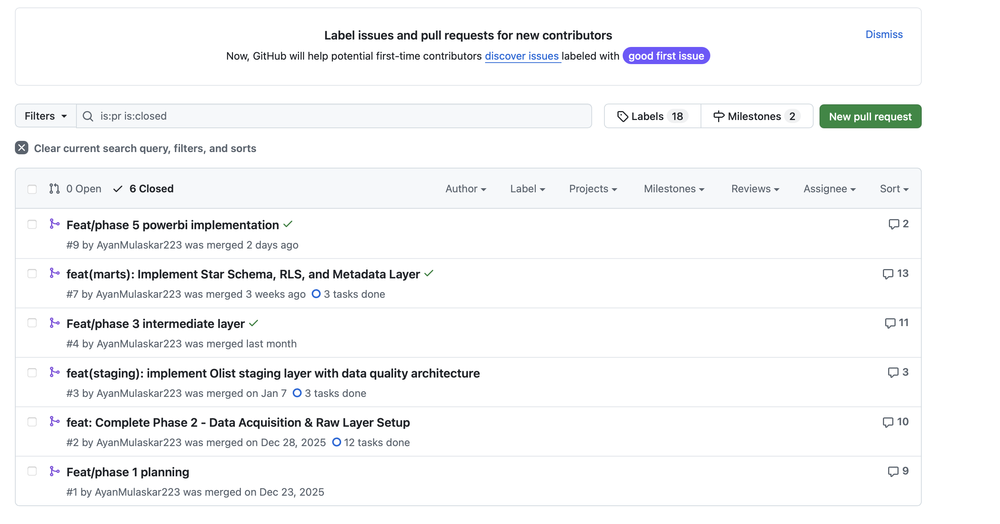
_All CI checks must pass before merge: SQLFluff, dbt build, BPA scan_

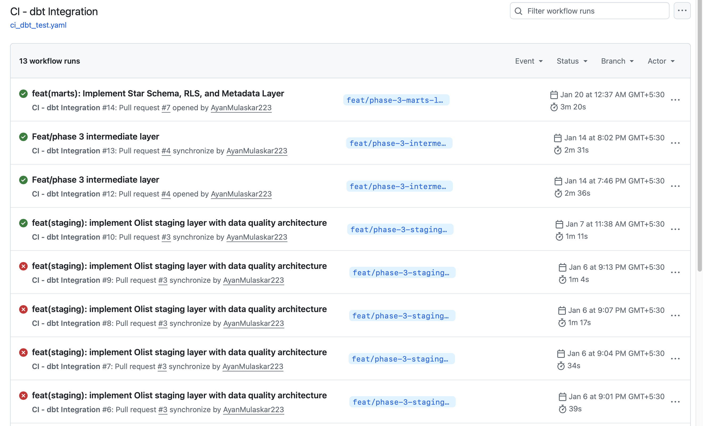
_Automated dbt build runs 559 tests on every pull request_

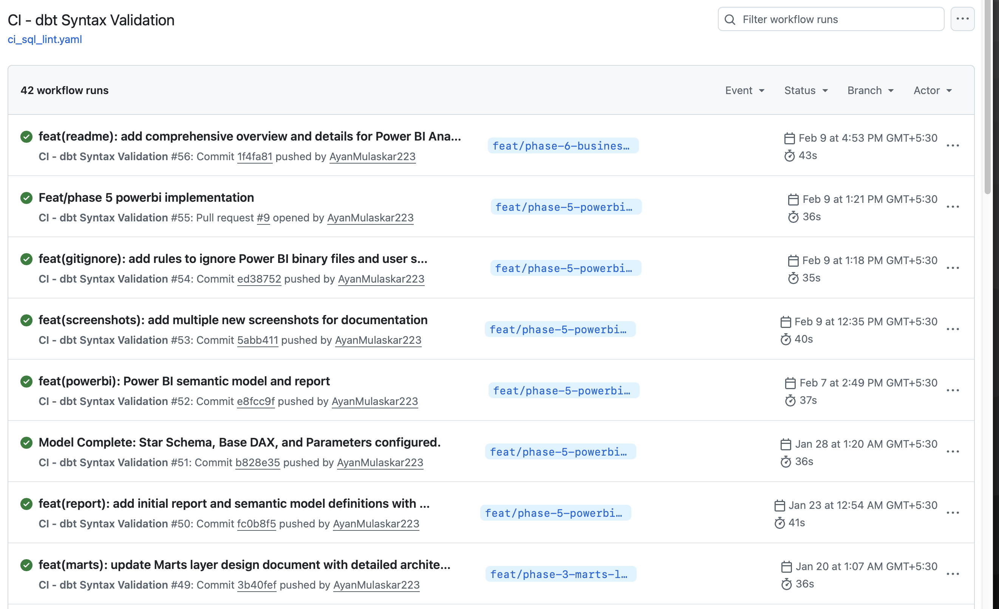
_SQL code quality enforced via SQLFluff with Snowflake dialect_

</details>

**Project Governance — Issues • Milestones • Release Tags**

| Tool              | What I Did                                                                                                                                                                                                                | Why It Helps                                                                         |
| :---------------- | :------------------------------------------------------------------------------------------------------------------------------------------------------------------------------------------------------------------------ | :----------------------------------------------------------------------------------- |
| **GitHub Issues** | 2 issues tracking the two largest deliverables: Marts layer (#5) and Power BI semantic model & reporting workflow (#8). Each closed only after the full deliverable was built and verified.                               | Prevents shipping half-built work; every issue is a complete, testable unit of value |
| **Milestones**    | 2 milestones scoped to the two highest-complexity phases (Phase 3: Marts & Phase 5: BI). Issues are linked to their milestone and remain open until the full layer — models, tests, semantic model, and reports — is done | Keeps scope honest; milestone closure = the whole layer works end-to-end             |
| **Release Tags**  | Semantic versioning on every delivery: `v0.2.0-phase2` → `v0.3.x-phase-3` → `v1.1.0-phase-5-powerbi` → `v1.2.0-phase-6-business-insights`                                                                                 | Permanent, reproducible snapshots — any phase can be checked out and re-run          |
| **Labels**        | `dax` • `dbt` • `documentation` • `governance` • `portfolio-ready` • `power-bi` • `schema-design` • `security` • `semantic-model`                                                                                         | Instant cross-cutting view — filter by concern (security, governance) not just phase |

---

**🔬 Tabular Editor 3 — Best Practice Analyzer (BPA)**

Industry-standard semantic model scanner — **50+ rules** across formatting, performance, naming, security, and relationship integrity. Runs after I build semantic model and then after I build report before PROD publish. Rules loaded via Tabular Editor's **C# scripting interface** from the official **[Microsoft Analysis Services BPA ruleset](https://github.com/microsoft/Analysis-Services/tree/master/BestPracticeRules)** (`BPARules.json`) — the same rule set used by enterprise Power BI teams worldwide.

| BPA Rule Category          | What It Validates                                     | Result          |
| :------------------------- | :---------------------------------------------------- | :-------------- |
| **Measure Formatting**     | All measures use explicit FORMAT strings              | ✅ 0 violations |
| **Performance**            | No high-cardinality columns in wrong relationship dir | ✅ 0 violations |
| **Naming Conventions**     | Hidden foreign keys, consistent measure naming        | ✅ 0 violations |
| **Relationship Integrity** | No ambiguous paths, inactive relationships flagged    | ✅ 0 violations |
| **RLS Enforcement**        | Security roles defined, applied, and tested           | ✅ 0 violations |
| **Overall Score**          | **50+ rules scanned automatically on every change**   | ✅ **0 issues** |

<details>
<summary><strong>📸 Show BPA Scan Evidence (Before → After)</strong></summary>

<table>
<tr>
<td width="50%">

**Before: Multiple BPA violations**
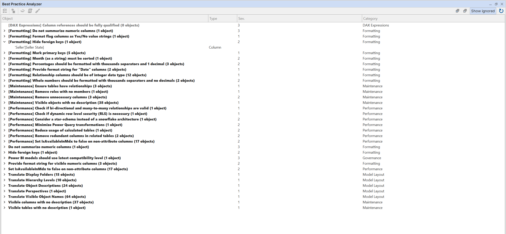

</td>
<td width="50%">

**After: 0 issues — Production certified**
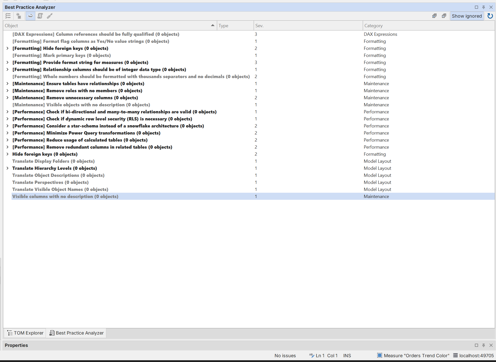

</td>
</tr>
</table>

</details>

---

**🚀 Power BI Dev → UAT → Prod Deployment Workflow**

```
Power BI Desktop  ──publish──▶  [DEV] Workspace  ──UAT──▶  [PROD] Workspace  ──publish──▶  Olist Executive Analytics (App)
                                       │                           │
                               UAT checks run here        Certified Dataset
                               KPIs must match Marts layer     Scheduled refresh: 6:15 PM IST
                               RLS role validation        Email subscriptions active
                               BPA scan: 0 issues ✅      5 pages (2 reports) + Executive Pulse Dashboard live
```

| Stage                  | Tool / Action                                                             | Gate                                  |
| :--------------------- | :------------------------------------------------------------------------ | :------------------------------------ |
| **1. Build**           | Power BI Desktop — develop semantic model + reports                       | Local smoke test                      |
| **2. DEV Deploy**      | Publish from Desktop → `Olist Analytics [DEV]`                            | Rapid iteration; not user-facing      |
| **3. UAT — Finance**   | Revenue reconciliation: PBI vs Snowflake SQL                              | ✅ Total matches to penny             |
| **4. UAT — Security**  | "View as Role: State_Manager" in Power BI Desktop                         | ✅ Correct state filter enforced      |
| **5. BPA Scan**        | Tabular Editor 3 → 50+ rules checked automatically                        | ✅ 0 issues before PROD publish       |
| **6. PROD Deploy**     | Re-publish from Desktop → `Olist Analytics [PROD]`                        | Certified dataset; governed           |
| **7. App & Dashboard** | Publish `Olist Executive Analytics` app + pin `Executive Pulse` dashboard | ✅ Refresh 6:15 PM IST, subscriptions |

<details>
<summary><strong>📸 Show UAT & Deployment Evidence</strong></summary>

<table>
<tr>
<td width="50%">

**UAT: Revenue Reconciliation (Finance sign-off)**
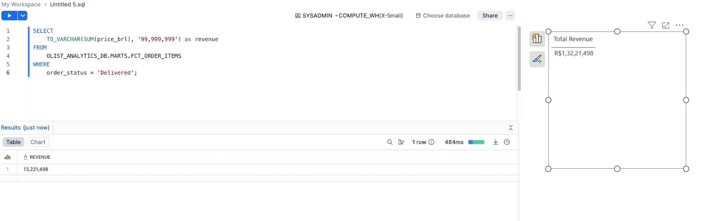

</td>
<td width="50%">

**UAT: RLS "View as Role" Validation**
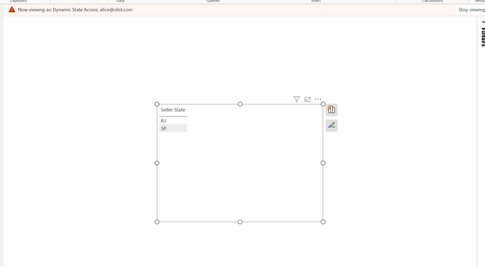

</td>
</tr>
</table>

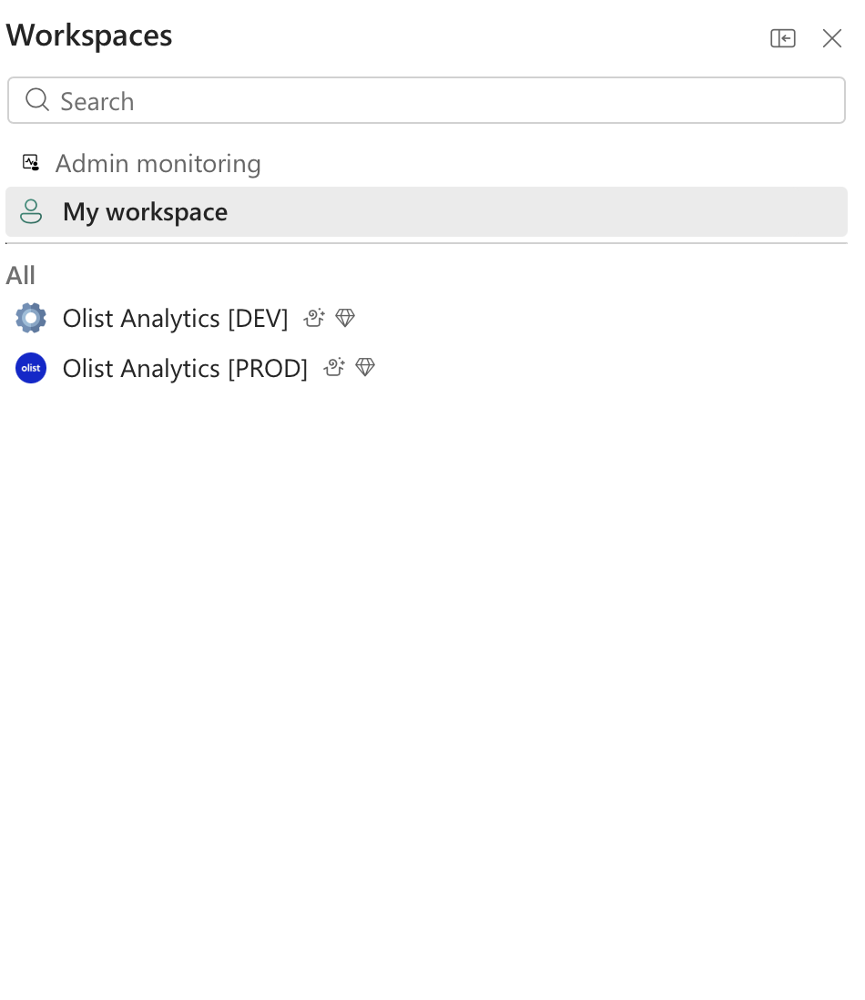
_DEV workspace for iteration → PROD workspace for certified, governed consumption_

</details>

---

**Key Achievements:**

- ✅ **Two-stage CI:** Fast syntax check on every push + full Snowflake integration test on PR
- ✅ **Ephemeral PR schemas:** `CI_PR_<number>` isolated per PR, auto-cleaned → zero shared state
- ✅ **Pre-commit hooks:** 4-layer guard before every commit — **hygiene** (trailing whitespace, EOF, YAML/JSON validation, 500KB file size limit) → **security** (blocks `.env` files, credential files, private keys, large CSVs) → **SQL quality** (SQLFluff lint + auto-fix on `models/` and Snowflake SQL with Jinja templating) → **docs** (markdownlint auto-fix)
- ✅ **Blocking gates:** Failed tests prevent merge — 100% enforcement, no exceptions
- ✅ **Source freshness monitoring:** 8 sources, tiered SLA windows (1–30 days) — stale data caught before users
- ✅ **Tabular Editor 3 BPA:** 50+ rules, 0 issues — semantic model hardened before every prod deploy
- ✅ **Dev → UAT → Prod:** Finance reconciliation + RLS validation before any report goes live
- ✅ **Power BI Org App:** `Olist Executive Analytics` — certified dataset, scheduled refresh, email subscriptions, `Executive Pulse` pinned dashboard
- ✅ **Power BI Service Lineage View:** Workspace lineage traces the full delivery chain — Snowflake datasource → `Olist Semantic Model` → `Olist Executive Dashboard` report → `Executive Pulse` dashboard → `Olist Executive Analytics` app — every dependency visible and impact-analyzable before any upstream change

---

### 🧱 3. Data Modeling & Transformation

**dbt Core — Medallion Architecture + Star Schema**

| Layer             | Materialization | Models | Tests | Purpose                                                                       |
| :---------------- | :-------------- | :----- | :---- | :---------------------------------------------------------------------------- |
| **STAGING**       | Views           | 9      | 90+   | 1:1 with RAW, type casting                                                    |
| **INTERMEDIATE**  | Tables/Views    | 3      | 4     | Business logic, identity resolution, reusable joins                           |
| **MARTS (Facts)** | Tables/Incr     | 1      | 21+   | `fct_order_items` — 112,650 transactions                                      |
| **MARTS (Dims)**  | Tables          | 6      | 14+   | Customers (96K) • Products (32K) • Sellers (3K) • Date (1,096 days) • RLS (2) |
| **SEEDS**         | Tables          | 3      | —     | Reference data (category translations, RLS mapping)                           |
| **META**          | Table           | 1      | —     | Heartbeat table (dual-clock freshness signal)                                 |

**Test Coverage Breakdown (559 total):**

| Test Category      | Count   | Scope                                                                         |
| :----------------- | :------ | :---------------------------------------------------------------------------- |
| **Source Tests**   | 85      | `not_null`, `unique`, `relationships`, `accepted_values` on RAW source tables |
| **Generic Tests**  | 456     | Schema tests on all staging + intermediate + mart model columns               |
| **Singular Tests** | 18      | Custom SQL business-rule assertions (cross-column + domain logic)             |
| **Total**          | **559** | **100% pass rate** ✅                                                         |

**`dbt_project_evaluator` — BPA for dbt Projects**

> The dbt equivalent of Tabular Editor BPA. While other packages test the **data**, `dbt_project_evaluator` audits the **project itself** — DAG structure, model naming, test coverage gaps, and documentation completeness. Violations surface as queryable SQL rows, not just linter warnings. Result: **PASS=76, WARN=5, ERROR=0** enforced on every CI run.

📖 **[Full package list & usage →](https://ayanmulaskar223.github.io/olist-modern-analytics-platform/06_engineering_standards/)**

<details>
<summary><strong>📸 Show dbt Implementation Evidence</strong></summary>

<br>

**Data Lineage & Transformation**


_Complete data lineage from RAW → STAGING → INTERMEDIATE → MARTS with 35+ models_

**📊 dbt Exposures: Downstream Impact Analysis**

**What:** Link dbt models to downstream consumers (Power BI dashboards, reports) for impact analysis.

**Implementation:**

```yaml
# models/exposures.yml
exposures:
  - name: olist_analytics_dashboard
    type: dashboard
    maturity: high
    owner:
      name: Analytics Team
    depends_on:
      - ref('fct_orders')
      - ref('fct_order_items')
      - ref('dim_customers')
      - ref('dim_products')
```

**Business Impact:**

- ✅ **Change impact visibility:** Know which dashboards break before model changes
- ✅ **Dependency mapping:** Clear graph from marts → Power BI semantic model
- ✅ **Ownership tracking:** Every dashboard has defined owner and maturity level
- ✅ **Faster debugging:** Trace dashboard issues back to exact upstream model

📖 **[View exposures.yml →](03_dbt/models/exposures.yml)**

---


_559 automated tests validating data quality at every layer_


_Auto-generated technical documentation with searchable model catalog_


_Fail-fast schema validation prevents breaking changes_


_Incremental materialization reduces compute by processing only new data_

</details>

**🔄 Reusability Pattern:** Intermediate models define business logic once, reused by 3+ mart models — **50% faster development**, zero duplicate SQL.

<details>
<summary><strong>📐 Show Code: Without vs With Intermediate Models</strong></summary>

<br>

<table>
<tr>
<td width="50%" valign="top">

**❌ Without Intermediate Models:**

```sql
-- fct_orders.sql
-- ❌ Duplicate customer enrichment logic
select
  o.*,
  count(distinct prev.order_id) as order_count
from stg_orders o
left join stg_orders prev
  on o.customer_id = prev.customer_id
group by o.customer_id
```

```sql
-- fct_order_items.sql
-- ❌ Same logic repeated again!
select
  oi.*,
  count(distinct o.order_id) as order_count
from stg_order_items oi
left join stg_orders o
  on oi.customer_id = o.customer_id
group by oi.customer_id
```

**Problem:** Duplicate logic, inconsistent results, slow development

</td>
<td width="50%" valign="top">

**✅ With Intermediate Models:**

```sql
-- int_customers_enriched.sql
-- ✅ Define ONCE, reuse everywhere
with orders_agg as (
  select
    customer_id,
    count(distinct order_id) as order_count,
    sum(order_total) as lifetime_value
  from {{ ref('stg_orders') }}
  where order_status = 'delivered'
  group by 1
)
select
  c.*,
  coalesce(o.order_count, 0) as customer_order_count,
  case when o.order_count >= 2
    then true else false
  end as is_repeat_customer
from {{ ref('stg_customers') }} c
left join orders_agg o using (customer_id)
```

**Result:** 3+ marts reuse this → **50% faster development**

</td>
</tr>
</table>

</details>

---

### ✅ 4. Data Quality & Governance

**"Verified vs Raw" pattern** — dual metrics (Total vs Verified Revenue), 559 automated tests, transparent quality tooltips, 96.5% verification rate.

**"Verified vs Raw" Pattern (Trust, Don't Trash)**

| Quality Dimension     | Implementation                                   | Business Impact                         |
| :-------------------- | :----------------------------------------------- | :-------------------------------------- |
| **Master Flag**       | `is_verified` (boolean) on every row             | Dual metrics: Total vs Verified Revenue |
| **Diagnostic Flag**   | `quality_issue_reason` (text)                    | Actionable correction lists             |
| **Automated Testing** | 559 tests in CI pipeline                         | Catches 100% FK violations before merge |
| **Transparent UX**    | Hover tooltips expose verification % in Power BI | Finance reconciles exact penny amounts  |
| **Proactive Alerts**  | dbt freshness checks + refresh failure alerts    | Issues detected before user impact      |

<details>
<summary><strong>📸 Show Data Quality Evidence</strong></summary>

<br>

**Quality Monitoring & Transparency**

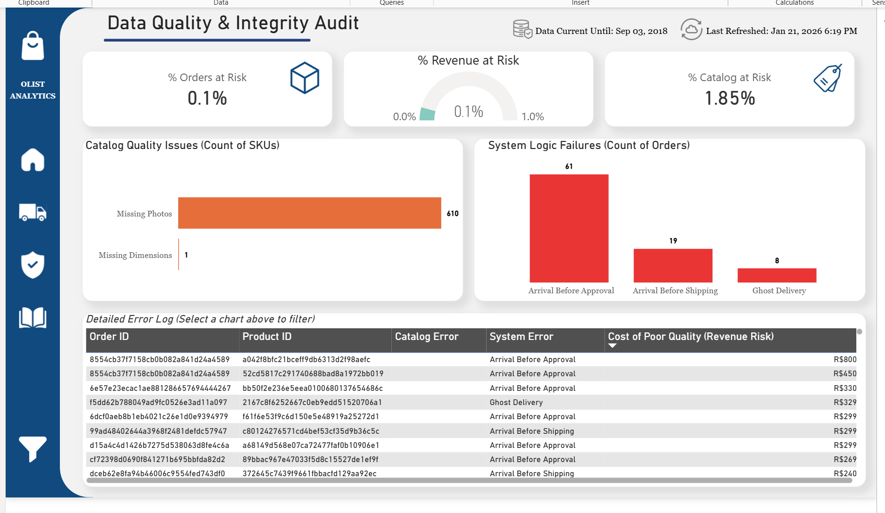
_Transparent quality metrics: 96.5% verification rate with detailed issue tracking_

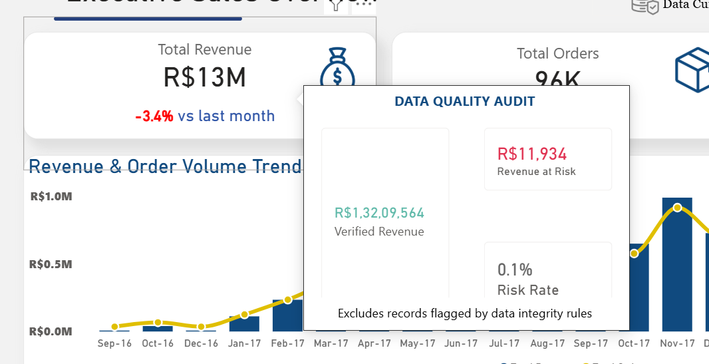
_Hover tooltips expose verification % and at-risk revenue for every KPI_

---

**Finance Reconciliation & Validation**


_Finance reconciliation: Total Revenue vs Verified Revenue dual-metric pattern_


_Row-Level Security validation restricts managers to their state/region_

---

**Schema Contracts & Data Integrity**

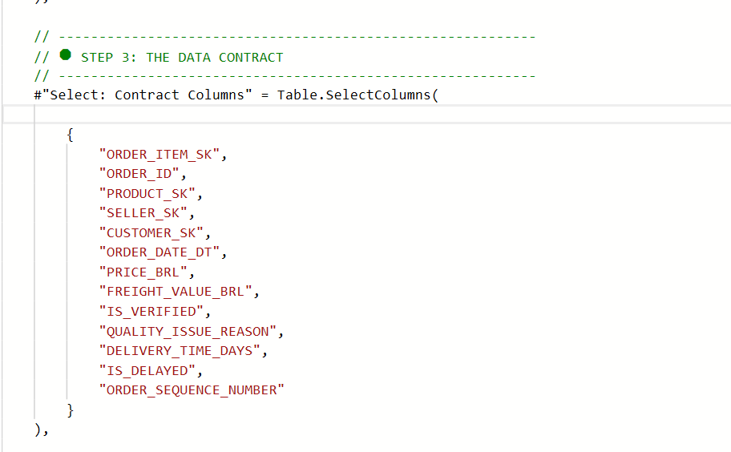
_Explicit column selection prevents schema drift between Snowflake and Power BI_

</details>

**🔒 Data Contracts: Fail-Fast Schema Enforcement**

Explicit contracts at both dbt and Power BI layers — build fails on type change, column removal, or schema drift. No silent dashboard breaks.

| Without Contracts                             | With Contracts                    |
| :-------------------------------------------- | :-------------------------------- |
| 😰 Column renamed → dashboards break silently | ✅ Build fails → fix before merge |
| 😰 Data type changed → incorrect calculations | ✅ Contract violation blocked     |
| 😰 Column removed → NULL values propagate     | ✅ Explicit error message         |

<details>
<summary><strong>📐 Show Code: dbt + Power BI Contract Implementation</strong></summary>

<br>

**TL;DR:** Explicit schema contracts at dbt and Power BI layers prevent silent schema drift and catch breaking changes before production.

<table>
<tr>
<td width="50%" valign="top">

**1️⃣ dbt Layer Contracts**

```yaml
# models/marts/sales/fct_orders.yml
models:
  - name: fct_orders
    config:
      contract:
        enforced: true
    columns:
      - name: order_key
        data_type: varchar
      - name: customer_key
        data_type: varchar
      - name: order_total
        data_type: number
```

**Enforcement:**

- ✅ Build fails if column types change
- ✅ Build fails if columns are added/removed
- ✅ Upstream model changes blocked until contract updated

</td>
<td width="50%" valign="top">

**2️⃣ Power BI Layer Contracts**

```powerquery
// M-code explicit column selection
Source = Snowflake.Databases(...),
SelectColumns = Table.SelectColumns(
    Source,
    {
        "ORDER_KEY",
        "CUSTOMER_KEY",
        "ORDER_TOTAL",
        "ORDER_DATE_DT"
    }
)
```

**Enforcement:**

- ✅ Refresh fails if expected columns missing
- ✅ No silent column additions
- ✅ Explicit schema documentation in M-code

</td>
</tr>
</table>

</details>

📖 **[Complete Data Contracts Guide →](https://ayanmulaskar223.github.io/olist-modern-analytics-platform/06_engineering_standards/#5-data-contracts)**

---

### 📊 5. Semantic Layer & Business Intelligence

**`Olist Semantic Model`** — Star schema (1 fact table, 6 dimensions), 100% query folding, Self-Service 2.0: analysts certify the semantic layer; AI tools consume governed data.

**`Olist Semantic Model` — Star Schema**

<table>
<tr>
<td width="50%" valign="top">

**Architecture**

- 1 fact table — Sales (`fct_order_items`)
- 6 dimension tables (`dim_*`)
- 50+ centralized DAX measures
- Calculation groups for time intelligence
- Role-playing dimensions (3 date roles)
- Dynamic RLS via bridge table

</td>
<td width="50%" valign="top">

**Performance**

- <2s dashboard load time
- <1.2s visual rendering (all <1200ms)
- **DAX queries <30ms** (Performance Analyzer)
- 100% query folding validated
- Import Mode (star schema optimized)
- Incremental refresh on fact tables
- 82% faster refresh (45min → 8min)

**DAX Optimization Strategy**

- `VAR` for all multi-step calculations — prevents re-evaluation, improves readability
- No iterator functions (`SUMX`, `FILTER`) on large tables — pre-aggregated in dbt marts
- Heavy computed columns (delivery days, order sequence, quality flags) built in **dbt/Snowflake**, not Power BI — leverages SQL engine, eliminates VertiPaq overhead
- All measures validated in Performance Analyzer: DAX query time **<30ms** across all visuals

</td>
</tr>
</table>

<details>
<summary><strong>📸 Show BI Implementation Evidence</strong></summary>

<br>

**Semantic Model Architecture**

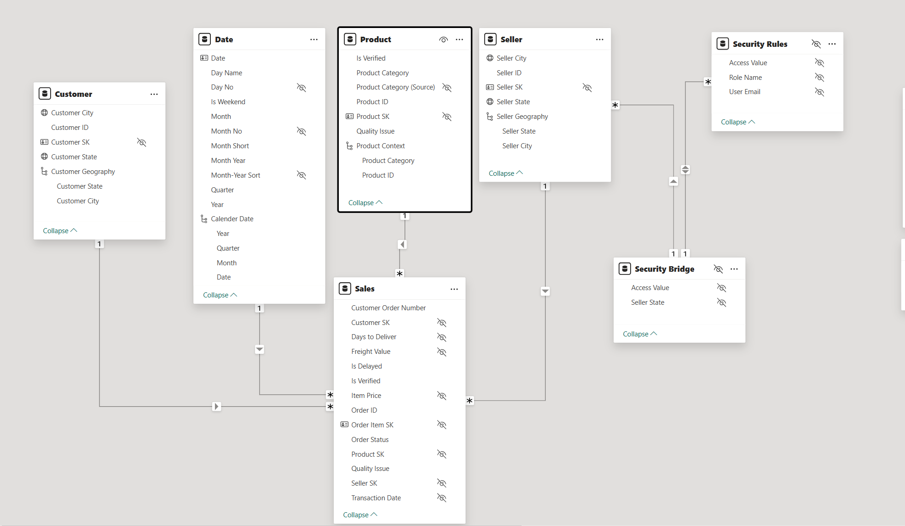
_Star schema: 1 fact table (Sales), 6 dimensions, 50+ DAX measures with descriptions_

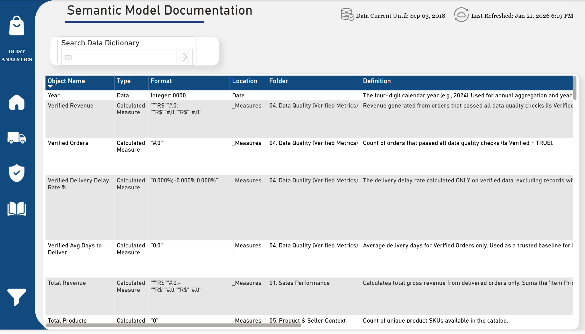
_Complete model documentation: table/column descriptions, relationships, measures_

---

**Query Performance Validation**

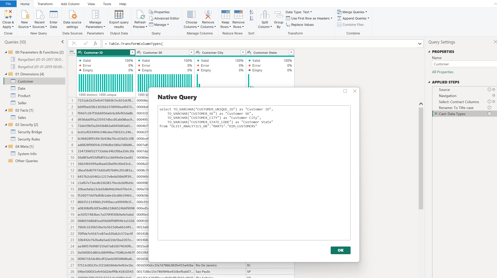
_100% query folding validated: zero M-code row-by-row processing_

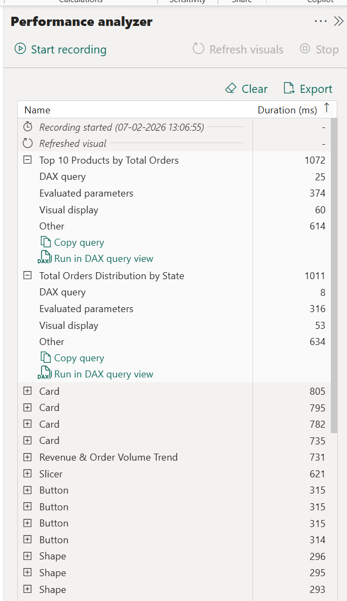
_Performance Analyzer: DAX queries <30ms — Executive page loads in <2 seconds_

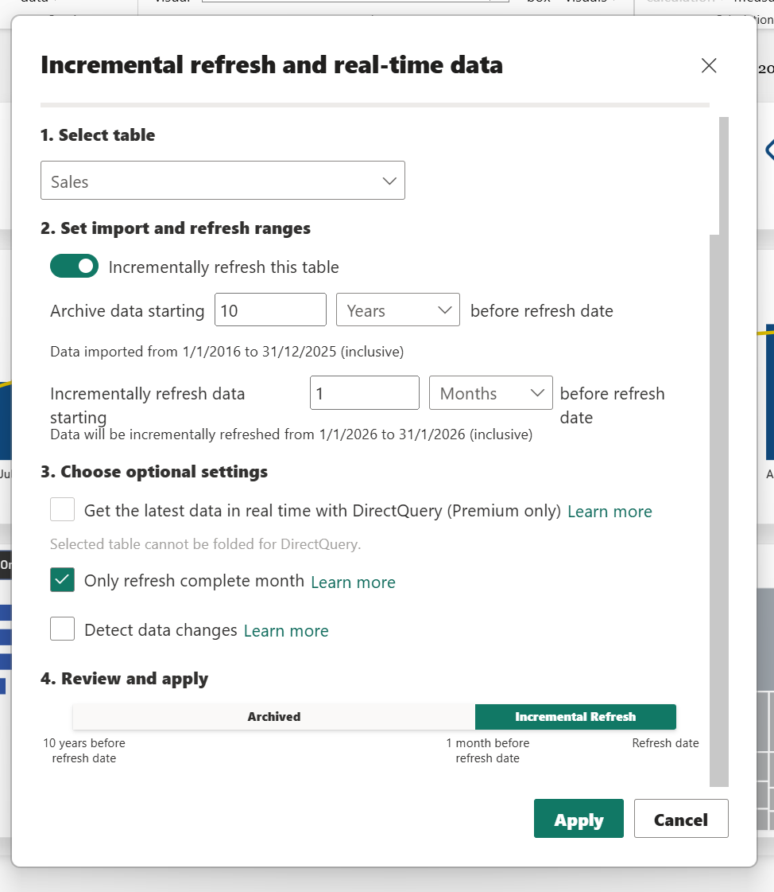
_Incremental refresh: 2-year rolling window with monthly partitions (82% faster)_

---

**Dashboard Showcase**


_Executive Dashboard: Top 4 KPIs, YoY trends, regional heatmap_

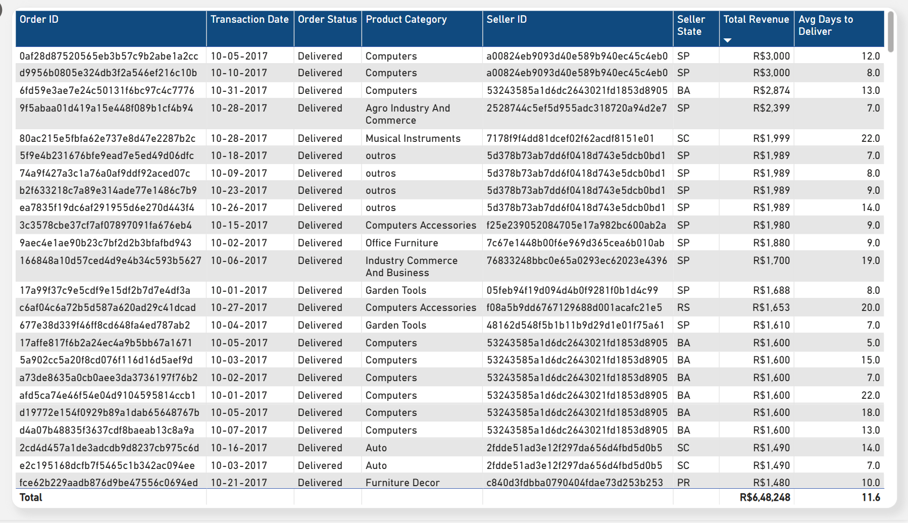
_Drill-through capability: Click state → see detailed Order ID-level analysis_

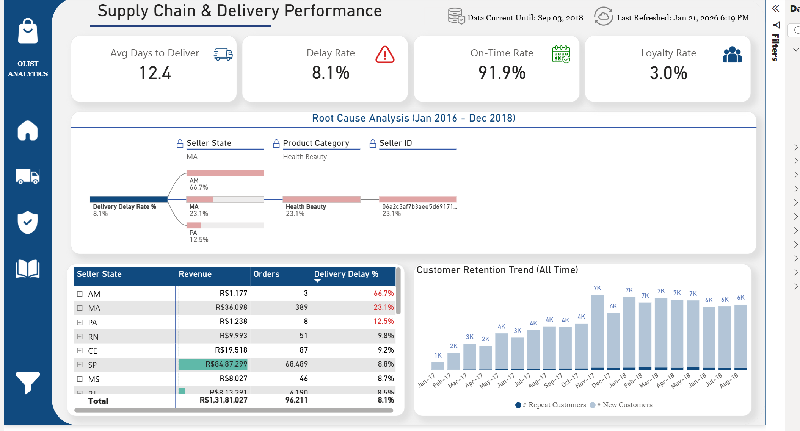
_Supply Chain Ops page: Logistics performance by carrier/state_

---

**Advanced Features**

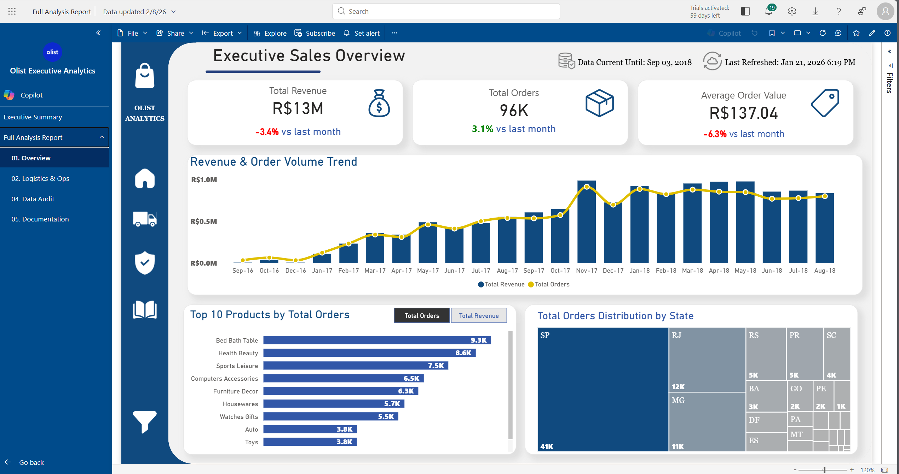
_Organizational app view: Different roles see different data via RLS_

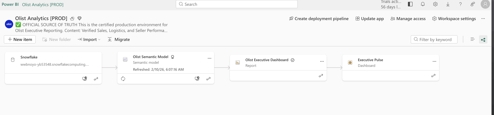
_Lineage view: End-to-end traceability from Snowflake tables to Power BI visuals_

</details>

**📊 Business Rules in DAX: "Delivered Orders Only"**

**Decision:** Business logic implemented in **DAX only** — not filtered in dbt. Full data preserved in marts; consumption-layer filters applied at semantic layer.

| Approach           | Trade-offs                                                       | Decision                                                    |
| :----------------- | :--------------------------------------------------------------- | :---------------------------------------------------------- |
| **dbt Filtering**  | ❌ Loses canceled/pending orders; can't analyze full pipeline    | Rejected — deletes 5%+ of data                              |
| **dbt Flag + DAX** | ⚠️ Dual-layer logic; two places to maintain rules                | Unnecessary for single status filter                        |
| **DAX-Only** ✅    | ✅ Single truth for business rules • full data in dbt • flexible | **Selected** — clean separation: dbt = quality, DAX = rules |

---

**🔐 Self-Service 2.0: Governed Analytics**

**Problem:** AI tools (Copilot, ChatGPT) generate professional-looking reports with mathematical errors — 17 "Revenue" definitions, metric chaos, zero traceability.
**Solution:** Analysts → Data Stewards. Certify the **semantic layer** once; every report and AI tool consumes governed, pre-verified data.

---

**Implementation: Empower Users + Maintain Control**

| Self-Service Enabler                       | Governance Control                              |
| :----------------------------------------- | :---------------------------------------------- |
| ✅ Certified semantic model (50+ measures) | RLS by state/region + RBAC in Snowflake         |
| ✅ Drag-and-drop trusted KPIs              | Pre-calculated in marts (no ad-hoc SQL)         |
| ✅ Auto-generated dbt docs catalog         | Column descriptions + full lineage              |
| ✅ Quality tooltips show `is_verified` %   | Transparent verification rates on every KPI     |
| ✅ Drill-through to transaction details    | Row-level security automatically enforced       |
| ✅ Self-service report creation            | Only certified measures (no custom DAX allowed) |

**Outcome:** ✅ **~40 hrs/week saved** • ✅ **0 metric conflicts** (single source of truth) • ✅ **AI-safe** (governed data layer) • ✅ **Finance reconciles to the penny**

**Architecture:** ✅ **PBIP + TMDL (`.pbir`)** — Git-tracked DAX + report JSON, code reviews for every semantic model change • ✅ **Data Dictionary** — table/column/measure descriptions in Tabular Editor 3, visible to users in Power BI Service • ✅ **Field Parameters** — Revenue/Orders toggle reusable across all visuals • ✅ **BPA: 0 issues** • ✅ **RLS** — dynamic `USERPRINCIPALNAME()` bridge table (27 states) • ✅ **`Executive Pulse` Dashboard + `Olist Executive Analytics` App** — pinned leadership dashboard + organizational app published in Power BI Service

---

**🚀 Production — `Olist Executive Analytics` App**

**2 Reports • 5 Pages • 1 Pinned Dashboard:**

| Report / Asset                    | Page                              | Audience            | Key Visuals                                                                                        |
| :-------------------------------- | :-------------------------------- | :------------------ | :------------------------------------------------------------------------------------------------- |
| **Olist Executive Dashboard**     | 1. Executive Sales Overview       | C-Suite             | KPI cards, YoY trend, Top 10 Products, State Treemap, Revenue/Orders field parameter toggle        |
| **Olist Executive Dashboard**     | 2. Supply Chain & Delivery        | Ops Managers        | Decomposition Tree (root cause), Delay Rate by state/carrier                                       |
| **Olist Executive Dashboard**     | 3. Data Quality & Integrity Audit | Analytics Engineers | Verified vs Raw revenue, ghost delivery flags, revenue-at-risk catalog                             |
| **Olist Executive Dashboard**     | 4. Detailed Order View            | Analysts            | Transaction-level drill-through (Order ID granularity)                                             |
| **Olist Semantic Model**          | 5. Semantic Model Documentation   | All Users           | Built-in data dictionary: table/column/measure descriptions authored in Tabular Editor 3 + lineage |
| **Executive Pulse** _(Dashboard)_ | Pinned KPI tiles                  | Leadership          | Revenue, Orders, AOV, Delay Rate — real-time at-a-glance in Power BI Service                       |

📖 **[Complete Self-Service 2.0 Framework →](https://ayanmulaskar223.github.io/olist-modern-analytics-platform/06_engineering_standards/#6-self-service-analytics-20-governance-focused)**

---

### 💰 6. DataFinOps & Cost Optimization

**Cloud-native cost controls — 42% compute reduction (X-Small + auto-suspend) • 60% storage savings (Azure lifecycle) • <$50/month all-in.**

**Cloud-Native Cost Controls**

| Cost Strategy           | Implementation                               | Savings                                                                                   |
| :---------------------- | :------------------------------------------- | :---------------------------------------------------------------------------------------- |
| **Compute**             | X-Small warehouses + 60s auto-suspend        | **42% reduction**                                                                         |
| **Storage**             | Azure Blob lifecycle (Hot→Cool→Archive)      | **60% reduction**                                                                         |
| **dbt Incremental**     | Merge on `order_item_sk` (new rows only)     | **75% faster** (2 min → 30 sec) • **95% cheaper** ($0.15 → $0.008) • **99.6% fewer rows** |
| **Power BI Refresh**    | 2-year rolling window, monthly partitions    | **82% faster** (45 min → 8 min)                                                           |
| **Query Attribution**   | Query tagging per model/team                 | Cost transparency                                                                         |
| **Resource Monitoring** | Snowflake monitors (100-credit/month cap)    | Prevents cloud bill shock                                                                 |
| **Total Platform Cost** | X-SMALL warehouses + lifecycle + incremental | **<$50/month** (all-in)                                                                   |

<details>
<summary><strong>📸 Show Cost Optimization Evidence</strong></summary>

<br>

**Compute Cost Controls**


_X-Small warehouses with 60-second auto-suspend eliminate idle costs_

---

**Storage Cost Optimization**


_Automated tiering: Hot (30 days) → Cool (90 days) → Archive (365 days) = 60% savings_

---

**Refresh Performance Optimization**


_Incremental refresh with 2-year rolling window: 82% faster (45 min → 8 min)_

</details>

---

### 🤖 7. AI-Assisted Development & Agentic Workflows

**2x velocity using GitHub Copilot + ChatGPT with context engineering — 100% test coverage maintained through human validation gates.**

**AI-Powered Developer Productivity with Governed Quality**

<table>
<tr>
<td width="50%" valign="top">

**🚀 AI Accelerates:**

- ✅ dbt model boilerplate generation
- ✅ SQL CTE refactoring for readability
- ✅ DAX measure optimization patterns
- ✅ YAML documentation scaffolding
- ✅ Complex JOIN strategy suggestions
- ✅ Test case auto-generation

**Tools:**

- GitHub Copilot (inline suggestions)
- ChatGPT (complex refactoring)
- Structured context via `.github/copilot-instructions.md`
- AI agent definitions for specialized personas

</td>
<td width="50%" valign="top">

**✅ Humans Validate:**

- ✅ Pre-commit hooks: 4-layer guard — hygiene → security (blocks `.env`, credentials, private keys) → SQLFluff lint+fix → markdownlint
- ✅ 559 dbt tests (CI blocking gates)
- ✅ BPA semantic model scans
- ✅ Manual code review for business logic
- ✅ Performance Analyzer validation
- ✅ Finance reconciliation sign-off

**Result:**

- **40% faster SQL drafting**
- **100% test coverage maintained**
- **Zero untested code merged**

</td>
</tr>
</table>

**🧠 Context Engineering in Practice**

> **Context Engineering** — the discipline of designing and managing the full information context supplied to an LLM (system prompts, conversation history, retrieved documents, tool outputs) to produce consistent, high-quality results at scale. Goes beyond prompt engineering to treat context as a **first-class engineering artifact**.

| Context Layer                    | Artifact                                                                              | Engineering Decision                                                  | Productivity Gain                                        |
| :------------------------------- | :------------------------------------------------------------------------------------ | :-------------------------------------------------------------------- | :------------------------------------------------------- |
| **System Prompt / Identity**     | `.github/copilot-instructions.md` (tech stack, business rules, phase-aware standards) | Persistent project memory baked in — never re-explained               | Eliminates 15-20 min context re-explanation per session  |
| **Agent Scoping**                | `01_Snowflake_Architect` • `02_Analytics_Engineer` • `03_BI_Developer`                | Each agent holds only its layer's context — no cross-layer leakage    | Focused, higher-quality output per phase                 |
| **Prompt Engineering**           | `.github/prompts/*.prompt.md` — role, task, format, constraints encoded per pattern   | Structured input = deterministic output; reproducible across sessions | Consistent model generation + 40% faster SQL drafting    |
| **Conversation Context Windows** | Rolling session summaries passed as structured `<context>` blocks                     | LLM sees curated state, not raw chat history — prevents context drift | Coherent multi-session development without regression    |
| **Retrieval Layer**              | Dedicated ChatGPT Project with architecture + requirements + data dictionary loaded   | Pre-populated retrieval context = zero lookup overhead per query      | 2x velocity + **zero quality drop** across long sessions |

📖 **[Complete AI Engineering Workflow Documentation →](https://ayanmulaskar223.github.io/olist-modern-analytics-platform/06_engineering_standards/#5-ai-assisted-development-agentic-analytics-workflows)**

---

### ♻️ Built to Be Reused

**Why it matters:** Most analytics projects waste 60–70% of early sprint time rebuilding the same foundations — staging patterns, date dimensions, CI setup, test coverage. Investing in reusable architecture once means Project 2 (same domain: orders, customers, products) starts at the mart layer, not the raw layer.

| Asset                                         | Project 2 Benefit (same domain)                                                          | Time Saved  |
| :-------------------------------------------- | :--------------------------------------------------------------------------------------- | :---------- |
| **Staging models (`stg_*`)**                  | Orders, customers, products already typed + standardised — extend, don't rewrite         | ~**2 days** |
| **`dim_date`, `dim_customer`, `dim_product`** | Conformed dimensions drop straight in — star schema is already proven for this domain    | ~**3 days** |
| **dbt test + contract layer**                 | 559 tests + schema YAML re-point to new models — full coverage from day 1                | ~**1 day**  |
| **CI pipeline**                               | SQLFluff → ephemeral schema → `dbt build` → cleanup — zero reconfiguration needed        | ~**1 day**  |
| **Power BI Golden Dataset + RLS**             | DAX measures and state-level security template carry over — add new pages, not new logic | ~**2 days** |

> **~9 days saved on Project 2 — team starts shipping insights on day 1, not day 10.**

---

### 🎯 Summary: 7 Enterprise-Grade Capabilities

| Capability                | Technical Depth                                                                                                                                                                         | Business Value                                        |
| :------------------------ | :-------------------------------------------------------------------------------------------------------------------------------------------------------------------------------------- | :---------------------------------------------------- |
| **1. Cloud Architecture** | Multi-database Medallion + RBAC + Time Travel                                                                                                                                           | 90-day recovery + audit-ready security                |
| **2. DataOps & CI**       | 2-stage GitHub Actions + ephemeral PR schemas + **Tabular Editor 3 BPA** (0 issues) + Dev→UAT→Prod                                                                                      | Zero prod breaks + zero untested merges               |
| **3. Data Modeling**      | dbt + 7 packages + Star Schema + 559 tests + lineage DAG                                                                                                                                | 100% traceability + 0% metric drift                   |
| **4. Data Quality**       | "Verified vs Raw" + automated testing + alerts                                                                                                                                          | R$11K+ monthly revenue protected                      |
| **5. Semantic Layer**     | `Olist Executive Dashboard` + `Olist Semantic Model` reports + `Executive Pulse` dashboard + `Olist Executive Analytics` app + Data Dictionary + PBIP (`.pbir`) + DAX optimized (<30ms) | Governed AI-safe analytics + fully documented metrics |
| **6. DataFinOps**         | Incremental refresh + auto-suspend + lifecycle                                                                                                                                          | 42% compute + 60% storage cost savings                |
| **7. AI Development**     | **Context engineering** (system prompts + agent scoping + conversation windows) + CI gates                                                                                              | 2x velocity + 100% quality maintained                 |

**Result:** Production-ready analytics platform with enterprise-grade automation, AI-augmented development, governance, and performance optimization.

📖 **Technical Details:** [Engineering Standards](https://ayanmulaskar223.github.io/olist-modern-analytics-platform/06_engineering_standards/) • [Architecture Documentation](https://ayanmulaskar223.github.io/olist-modern-analytics-platform/01_architecture/)

---

## 5️⃣ Key Engineering Decisions

> Senior engineers explain **why**, not just what. Five architectural choices — each with a business problem, technical answer, and quantified impact.

| #   | Decision                | Summary                                                                      | Impact                                                                  |
| :-- | :---------------------- | :--------------------------------------------------------------------------- | :---------------------------------------------------------------------- |
| 1   | **Dual Clock Footer**   | Two timestamps (pipeline + source) enable instant failure triangulation      | Eliminates hours of "data or sales problem?" triage                     |
| 2   | **Verified vs Raw**     | Flag dirty data (`is_verified`), never delete it                             | 100% financial reconciliation + R$11K+ revenue visible                  |
| 3   | **Self-Service 2.0**    | Certify the semantic layer, not individual reports                           | ~40 hrs/week saved, AI-safe analytics                                   |
| 4   | **Incremental Refresh** | Process only new/changed rows; 2-year rolling window                         | **95% cheaper** ($0.15→$0.008) • **75% faster** • **<$50/month** all-in |
| 5   | **Bi-Directional RLS**  | Bridge table + controlled bi-directional filter for dynamic many-to-many RLS | Scalable territory management + <1.2s performance maintained            |

---

<details>
<summary><strong>🔍 Decision #1: Dual Clock Footer — Failure Mode Triangulation</strong></summary>

<table>
<tr>
<td width="30%"><strong>🤔 The Question</strong></td>
<td>

**Why display "Data Current Until" instead of just "Last Refreshed"?**

Standard refresh timestamps create **Silent Failures**. A single "Last Refreshed" timestamp can't distinguish between:

- ❌ **Pipeline Failure** (dbt didn't transform data)
- ❌ **Source System Failure** (no new sales data arriving from upstream)
- ❌ **Legitimate Business Event** (actually zero sales that day)

Finance sees flat revenue and asks: _"Is our POS system down, is the pipeline broken, or did we really have zero sales?"_

</td>
</tr>
<tr>
<td><strong>✅ The Answer</strong></td>
<td>

**Dual-clock singleton table enabling failure triangulation:**

```sql
-- dbt meta_project_status (1 row "heartbeat" table)
SELECT
    CURRENT_TIMESTAMP() AS pipeline_last_run,      -- When dbt transformed data
    MAX(order_date) AS business_data_current_until -- Latest transaction timestamp
FROM {{ ref('fct_orders') }}
```

**Power BI footer displays BOTH for instant diagnosis:**

1. **Last Refreshed** = `pipeline_last_run` → Detects **pipeline failures**
2. **Data Current Until** = `business_data_current_until` → Detects **source system failures**

</td>
</tr>
<tr>
<td><strong>💡 Why It Matters</strong></td>
<td>

| Last Refreshed | Data Current Until | Diagnosis                                     |
| :------------- | :----------------- | :-------------------------------------------- |
| Today          | Yesterday          | ✅ **Healthy** (both systems working)         |
| Today          | 3 days ago         | 🚨 **Source System Down** (no new sales data) |
| 3 days ago     | Yesterday          | 🚨 **Pipeline Failure** (dbt stopped running) |
| 3 days ago     | 3 days ago         | 🚨🚨 **Both Failed** (escalate immediately)   |

**Stakeholder Impact:** Finance instantly knows _where_ to escalate — eliminates hours of "Is this a sales problem or a data problem?" diagnostics.

</td>
</tr>
</table>

</details>

<details>
<summary><strong>🔍 Decision #2: "Verified vs Raw" Pattern — Trust, Don't Trash</strong></summary>

<table>
<tr>
<td width="30%"><strong>🤔 The Question</strong></td>
<td>

**Should we filter out "dirty" data (ghost deliveries, incomplete products) or load everything?**

Analysis revealed specific quality failures:

1. **Logistics:** Invalid timestamps — Ghost Delivery (delivery date exists, no shipping date) • Arrival Before Shipping • Arrival Before Approval
2. **Product Catalog:** 600+ products missing photos or physical dimensions

_Traditional Approach:_ Delete rows → "Black Box" pipeline that under-reports Revenue and hides Inventory problems.

</td>
</tr>
<tr>
<td><strong>✅ The Answer</strong></td>
<td>

**Strategy: "Flag upstream, Filter downstream."**

Instead of dropping rows, implement **Binary Verification Logic** in dbt (`int` layer):

1. **Flag Generation:** `is_verified` (1/0) + `quality_issue_reason` (text)
   - _If `delivered < shipped`: Flag 'Impossible Timeline'_
   - _If `photos_qty` is NULL: Flag 'Missing Metadata'_
2. **Dual-Metric Consumption** in Power BI:
   - **Raw Measures:** Sum of EVERYTHING (matches source system)
   - **Verified Measures:** `CALCULATE([Raw], is_verified = 1)` (operational truth)

</td>
</tr>
<tr>
<td><strong>💡 Why It Matters</strong></td>
<td>

- ✅ **100% Financial Reconciliation:** Raw Revenue matches ERP to the penny
- ✅ **Actionable Ops Audits:** Marketing gets list of 610 SKUs missing photos; Logistics sees exact Ghost Orders
- ✅ **No Data Loss:** R$11K+ monthly "Revenue at Risk" categorized, not hidden
- ✅ **Trust:** Executives know the difference between _Systems Latency_ and _Bad Data_

**Philosophical Shift:** A robust data platform doesn't hide errors; it quantifies the cost of them.

</td>
</tr>
</table>

</details>

<details>
<summary><strong>🔍 Decision #3: Self-Service 2.0 — Governance-First, Not Free-for-All</strong></summary>

<table>
<tr>
<td width="30%"><strong>🤔 The Question</strong></td>
<td>

**With AI tools (ChatGPT, Power BI Copilot) enabling anyone to generate charts, how do we prevent "metric chaos" without blocking innovation?**

Traditional self-service led to:

- ❌ 17 different "Revenue" definitions across teams
- ❌ AI-generated reports with mathematical errors
- ❌ Professional-looking charts with hallucinated numbers
- ❌ Zero traceability of where metrics came from

</td>
</tr>
<tr>
<td><strong>✅ The Answer</strong></td>
<td>

**Role evolution: Analysts → Data Stewards**

Don't certify individual reports. Certify the **semantic layer** that AI consumes.

```yaml
# Power BI Golden Dataset (50+ pre-certified measures)
✅ Centralized metric definitions (no ad-hoc DAX)
✅ RLS + data contracts enforce security/schema
✅ Transparent quality flags ("Verified vs Raw")
✅ dbt lineage shows exactly where numbers come from
✅ AI tools consume GOVERNED data, not raw chaos
```

</td>
</tr>
<tr>
<td><strong>💡 Why It Matters</strong></td>
<td>

- ✅ ~40 analyst hours/week saved
- ✅ Finance trusts the numbers (single source of truth)
- ✅ **AI-safe analytics:** ChatGPT queries certified semantic layer — correct answers guaranteed
- ✅ IT maintains control; no ungoverned SQL exports
- ✅ **Strategic positioning:** Ahead of the curve on governed AI self-service

</td>
</tr>
</table>

</details>

<details>
<summary><strong>🔍 Decision #4: Incremental Refresh + Lifecycle — DataFinOps</strong></summary>

<table>
<tr>
<td width="30%"><strong>🤔 The Question</strong></td>
<td>

**Should we rebuild all 119,000 orders daily, or only load new/changed rows?**

Full refresh approach:

- ❌ 45+ minutes daily (compute waste)
- ❌ $12K+ annual cloud costs
- ❌ Reprocesses 99.8% unchanged data

</td>
</tr>
<tr>
<td><strong>✅ The Answer</strong></td>
<td>

**Incremental materialization with time-based windows:**

```yaml
# dbt_project.yml
models:
  marts:
    fct_orders:
      +materialized: incremental
      +unique_key: order_id
      +on_schema_change: fail # Data contract enforcement

    fct_order_items:
      +pre_hook: "DELETE FROM {{ this }} WHERE order_date < DATEADD(year, -2, CURRENT_DATE())"
```

**Power BI:** 2-year rolling window with monthly partitions

</td>
</tr>
<tr>
<td><strong>💡 Why It Matters</strong></td>
<td>

- ✅ **75% faster dbt runs:** ~2 min → ~30 sec
- ✅ **95% cheaper:** $0.15 → $0.008 per run (~500 new rows/day vs 112,650 full)
- ✅ **82% faster Power BI refresh:** 45 min → 8 min
- ✅ **Schema protection:** Incremental fails on breaking changes
- ✅ **<$50/month all-in** + $7K+ annual savings vs full-refresh pattern

</td>
</tr>
</table>

</details>

<details>
<summary><strong>🔍 Decision #5: RLS Bridge Table — Dynamic Many-to-Many Security</strong></summary>

<table>
<tr>
<td width="30%"><strong>🤔 The Question</strong></td>
<td>

**How do we implement dynamic Row-Level Security (RLS) when one manager oversees multiple states, and one state has multiple managers?**

A direct connection between a `Security Rules` table and `Seller` creates a **Many-to-Many (M:M) relationship**. In Power BI, native M:M relationships degrade query performance and create ambiguous filter paths through the Star Schema.

Furthermore, a standard single-direction filter means the `USERPRINCIPALNAME()` security check **stops at the intermediate table** and never propagates downstream to `Sales` — the actual sales data remains unfiltered and exposed.

</td>
</tr>
<tr>
<td><strong>✅ The Answer</strong></td>
<td>

**A Security Bridge Table with Controlled Bi-Directional Filtering.**

I resolved the M:M relationship by introducing `Security Bridge` — a bridge table keyed on `Seller State` Column. The filter chain flows as:

```
Security Rules ↔️ Security Bridge ➡️ Seller ➡️ Sales
```

**The technical override:** I explicitly enabled _"Apply security filter in both directions"_ **only** on the `Security Rules` ↔ `Security Bridge` relationship. This lets the `USERPRINCIPALNAME()` credential context flow upstream into the bridge and then propagate downstream through the single-direction star schema to filter the fact table automatically.

</td>
</tr>
<tr>
<td><strong>💡 Why It Matters</strong></td>
<td>

- ✅ **Star Schema Integrity:** The core reporting relationships (`Seller → Sales`) remain clean 1-to-Many — no ambiguous paths, no performance penalty on reporting queries.
- ✅ **Scalability:** Manager-to-territory assignments live in a **dbt seed file in Snowflake** — add, remove, or reassign regions with a data change, no DAX rewrites, no reopening Power BI Desktop.
- ✅ **Performance Isolation:** Bi-directional filtering is notoriously bad for query performance. By strictly isolating it to the two tiny security tables only, we achieve **enterprise-grade dynamic security without sacrificing the <1.2s dashboard rendering time**.
- ✅ **Enterprise Standard:** This is the Microsoft-recommended architectural pattern for dynamic, multi-tenant organizational security.

</td>
</tr>
</table>

</details></details>

---

## 6️⃣ Project Structure & Documentation Hub

### 📁 Repository Organization

```
olist-modern-analytics-platform/
├── 01_data_sources/           # Source data documentation & samples
├── 02_snowflake/              # Snowflake setup & ingestion scripts
│   ├── 01_setup/              # Infrastructure & RBAC
│   ├── 02_ingestion/          # COPY INTO scripts
│   └── 03_quality_checks/     # Data validation queries
├── 03_dbt/                    # dbt transformation layer
│   ├── models/
│   │   ├── staging/           # 1:1 with RAW tables
│   │   ├── intermediate/      # Business logic
│   │   └── marts/             # Star schema (fct_*, dim_*)
│   ├── tests/                 # Custom business rule tests
│   └── dbt_project.yml
├── 04_powerbi/                # Power BI semantic model & reports
│   └── src/olist_analytics.pbip
└── docs/                      # Comprehensive documentation
    ├── 00_business_requirements.md
    ├── 01_architecture.md
    ├── 03_data_quality.md
    ├── 06_engineering_standards.md
    └── 07_analytics_insights.md
```

📖 **[Detailed Structure Guide](https://ayanmulaskar223.github.io/olist-modern-analytics-platform/)**

Comprehensive documentation organized by topic:

| Doc                                                                                                                            | Description                                                 |
| :----------------------------------------------------------------------------------------------------------------------------- | :---------------------------------------------------------- |
| **[Business Requirements](https://ayanmulaskar223.github.io/olist-modern-analytics-platform/00_business_requirements/)**       | KPIs, success metrics, business rules                       |
| **[Architecture](https://ayanmulaskar223.github.io/olist-modern-analytics-platform/01_architecture/)**                         | End-to-end system design, data flow, layer responsibilities |
| **[Data Dictionary](https://ayanmulaskar223.github.io/olist-modern-analytics-platform/02_data_dictionary/)**                   | Source schema, column definitions, relationships            |
| **[Data Quality Strategy](https://ayanmulaskar223.github.io/olist-modern-analytics-platform/03_data_quality/)**                | "Verified vs Raw" pattern, test coverage, quality flags     |
| **[Semantic Model](https://ayanmulaskar223.github.io/olist-modern-analytics-platform/04_semantic_model/)**                     | Power BI design, DAX patterns, RLS implementation           |
| **[Performance Optimization](https://ayanmulaskar223.github.io/olist-modern-analytics-platform/05_performance_optimization/)** | Query folding, incremental refresh, VertiPaq tuning         |
| **[Engineering Standards](https://ayanmulaskar223.github.io/olist-modern-analytics-platform/06_engineering_standards/)**       | Code conventions, CI automation, naming standards           |
| **[Business Impact Analysis](https://ayanmulaskar223.github.io/olist-modern-analytics-platform/07_analytics_insights/)**       | Before/after metrics, ROI analysis, key findings            |

---

## 7️⃣ About & Credentials

**Author:** Ayan Mulaskar
**Role:** Aspiring Data Analyst & BI Developer | BI & Analytics Engineering (Modern Data Stack) Specialist
**Portfolio:** Demonstrating enterprise-grade Analytics Engineering

> **Industry-recognized certifications** validating technical expertise in modern data stack technologies.

<p align="center">

<!-- Snowflake Certifications -->

<a href="https://achieve.snowflake.com/319a985c-70d5-43b0-9eef-7df3d5ca006f" target="_blank"></a>

<!-- Microsoft Certifications -->

<a href="https://learn.microsoft.com/api/credentials/share/en-us/AyanMulaskar-5148/53FDAFA544D7E0C9?sharingId=D81FD61C059160D2" target="_blank"></a>
<a href="https://learn.microsoft.com/api/credentials/share/en-us/AyanMulaskar-5148/28914DC2F743C05A?sharingId=D81FD61C059160D2" target="_blank"></a>

<!-- dbt Certification -->

<a href="https://credentials.getdbt.com/9112f641-216f-4121-8690-820adfe8bf57" target="_blank"></a>

<!-- GitHub Certifications -->

<a href="https://www.credly.com/badges/64e29484-05b6-4d3c-a036-59884b26f7fc/linked_in_profile" target="_blank"></a>
<a href="https://www.credly.com/badges/63879d7f-0958-442e-8cd0-fa110d0b7bf6/linked_in_profile" target="_blank"></a>

<!-- Databricks Certifications -->

<a href="https://credentials.databricks.com/f0119afc-98d9-4005-abcd-d9a561fcb9b1#acc.SthaHkXo" target="_blank"></a>

</p>

**Verification:**
📜 **[View Certifications on LinkedIn](https://www.linkedin.com/in/ayan-mulaskar/details/certifications/)**

<details>
<summary><strong>💡 Why Certifications Matter for This Project</strong></summary>

<br>

| Certification                                            | Project Application                                                                                                                                |
| :------------------------------------------------------- | :------------------------------------------------------------------------------------------------------------------------------------------------- |
| **SnowPro® Associate: Platform Certification (SOL-C01)** | Multi-database architecture, RBAC security model, warehouse optimization, external stages for Azure Blob ingestion                                 |
| **Azure Data Fundamentals (DP-900)**                     | Blob storage lifecycle policies (Hot→Cool→Archive), cloud cost optimization, storage-compute separation strategy                                   |
| **Power BI Data Analyst (PL-300)**                       | Star schema semantic model, DAX measures, RLS implementation, Import Mode optimization, 100% query folding validation                              |
| **dbt Fundamentals**                                     | Medallion architecture (RAW→STAGING→MARTS), 35+ transformation models, 559 automated tests, schema contracts                                       |
| **GitHub Foundations**                                   | Version control for analytics code, PR workflows, branch protection, project tracking, issue management                                            |
| **GitHub Copilot**                                       | AI-assisted development `agent.md` & `prompt.md` with quality gates (SQLFluff + dbt tests), 40% faster SQL drafting, structured context management |
| **Databricks Generative AI Fundamentals**                | Understanding GenAI applications in data workflows, AI-assisted analytics, LLM integration patterns for business intelligence                      |

💡 **These aren't just badges** — every certification competency is **demonstrated with production code** in this repository.

</details>

**Connect:**

- 📧 Email: ayanmulaskar@gmail.com
- 💼 LinkedIn: [linkedin.com/in/ayan-mulaskar](https://www.linkedin.com/in/ayan-mulaskar)
- 🐙 GitHub: [@AyanMulaskar223](https://github.com/AyanMulaskar223)

---

## 📄 License

This project is licensed under the MIT License - see the [LICENSE](LICENSE) file for details.

**Data Source:** [Brazilian E-Commerce Public Dataset by Olist](https://www.kaggle.com/datasets/olistbr/brazilian-ecommerce) (CC BY-NC-SA 4.0)

---

<p align="center">
  <strong>Built with ❤️ following enterprise analytics engineering standards</strong><br>
  <sub>Production-ready • Portfolio-optimized </sub>
</p>
