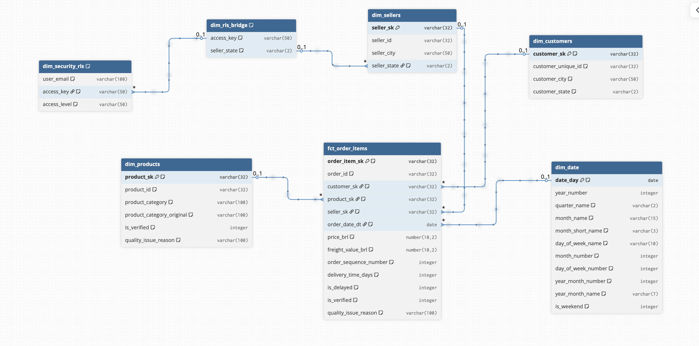

# 🏗️ System Architecture Overview

!!! warning "Portfolio Scenario"
This architecture describes a simulated Digital Transformation on the Olist public dataset. Design decisions and controls are documented as production-style patterns.

---

## 1. Document Purpose & Scope

This document describes the **end-to-end system architecture** of the Olist Modern Analytics Platform — covering data flow, system boundaries, environment strategy, governance design, and architectural decision rationale.

It intentionally **does not cover**: column-level semantics ([02_data_dictionary.md](02_data_dictionary.md)), business KPI definitions ([00_business_requirements.md](00_business_requirements.md)), data quality scores ([03_data_quality.md](03_data_quality.md)), DAX measure logic ([04_semantic_model.md](04_semantic_model.md)), or performance benchmark numbers ([05_performance_optimization.md](05_performance_optimization.md)).

**Target audience:** Analytics Engineers, BI Developers, and technical reviewers evaluating platform design maturity.

---

## 2. Architectural Principles

| Principle                             | Engineering Reason                                                                     |
| :------------------------------------ | :------------------------------------------------------------------------------------- |
| 🔀 **Separation of OLTP and OLAP**    | Source reads never touch the analytics warehouse — workloads never compete             |
| 🔒 **Raw data is immutable**          | Append-only landing zone; full replay and Finance reconciliation always possible       |
| 📝 **Version-controlled transforms**  | Every business rule lives in Git — reviewable, rollback-able, auditable                |
| ✅ **Trust is enforced, not assumed** | Data quality validated by 559 automated tests before any downstream consumption        |
| 🚫 **Fail fast, never silently**      | CI gates block bad models; no unvalidated code reaches production reports              |
| 🔑 **Least-privilege by default**     | Roles grant minimum access required — no shared credentials, no over-permissive grants |
| 💰 **Cost-awareness by design**       | Compute sized to workload; auto-suspend + storage tiers minimize waste                 |
| 🎯 **Single source of truth**         | Metrics defined once in the semantic layer and reused everywhere — no metric drift     |

---

## 3. High-Level System Overview

### 3.1 Logical Architecture

| Domain              | Responsibility                                              |
| :------------------ | :---------------------------------------------------------- |
| **Ingestion**       | Land raw source files into an immutable warehouse zone      |
| **Storage**         | Separate compute from storage; enforce schema boundaries    |
| **Transformation**  | Apply business logic in version-controlled, tested SQL      |
| **Consumption**     | Serve governed, certified metrics through a semantic layer  |
| **Governance & CI** | Enforce quality gates, access control, and deployment rules |

_End-to-end Modern Data Stack: Azure Blob → Snowflake → dbt → Power BI_

---

### 3.2 Physical Architecture

| Layer          | Technology               | Responsibility                                             |
| :------------- | :----------------------- | :--------------------------------------------------------- |
| **Ingestion**  | Azure Blob + `COPY INTO` | Idempotent file landing; multi-format (CSV, Parquet, JSON) |
| **Warehouse**  | Snowflake (OLAP)         | Separated compute/storage; transient RAW + curated MARTS   |
| **Transform**  | dbt Core                 | Business logic, testing, lineage, documentation            |
| **BI**         | Power BI (PBIP + TMDL)   | Semantic layer, measures, RLS, self-service consumption    |
| **CI/CD**      | GitHub Actions           | Two-stage quality gates: lint on push, full build on PR    |
| **Pre-commit** | pre-commit hooks         | Hygiene → security → SQLFluff → markdownlint enforcement   |

_Snowflake database separation: RAW_DB (immutable) → ANALYTICS_DB (production) → DEV_DB (sandbox)_

---

## 4. Data Flow Walkthrough

### 4.1 Source → Raw Layer

Source files are staged in **Azure Blob Storage** and loaded into Snowflake via `COPY INTO` with `FORCE = FALSE` — ensuring idempotency; files already loaded are skipped automatically. Connectivity uses **OAuth 2.0 Storage Integration** (not SAS tokens), meaning no credentials are stored in SQL scripts and access is revocable at the Azure IAM level.

File formats are assigned by data characteristics, not convention:

| Entity                                                                   | Format      | Rationale                                                                 |
| :----------------------------------------------------------------------- | :---------- | :------------------------------------------------------------------------ |
| Orders, Customers, Sellers, Geolocation, Reviews, Payments, Translations | **CSV**     | Tabular, low-complexity, standard delimiter                               |
| Order Items                                                              | **Parquet** | Highest-volume fact table (112K+ rows); columnar format reduces scan cost |
| Order Reviews                                                            | **JSON**    | Semi-structured review text; Snowflake's `PARSE_JSON` handles nesting     |

The RAW layer is **immutable by contract**: no transformation, no cleaning, no filtering. Every row lands exactly as received, with three audit columns appended (`_loaded_at`, `_source_file`, `_load_batch_id`). This preserves replay capability and provides a reconciliation baseline. Tables are created as **transient** — no Time Travel overhead on append-only data that can always be re-loaded from source.

_Azure Blob container structure — source files organized by entity before Snowflake ingestion_

---

### 4.2 Raw → Staging

!!! abstract "Staging Contract — Three rules that are never broken" - **Type casting only** — `VARCHAR → TIMESTAMP`, `STRING → NUMERIC`, whitespace trimmed, nulls handled - **1:1 mapping to RAW** — one model per source table; no joins, no filters, no business logic - **Materialized as views** — zero storage cost, always fresh from RAW on query

    MD5 surrogate keys (`dbt_utils.generate_surrogate_key`) are generated here. Natural source keys preserved as secondary columns for audit and reconciliation.

---

### 4.3 Staging → Intermediate

> **Business logic lives here — not in marts, not in Power BI.** Logic built once, reused everywhere.

| Logic Applied            | Business Problem                                                     | Implementation                                                  | Critical Constraint                                                                                                        |
| :----------------------- | :------------------------------------------------------------------- | :-------------------------------------------------------------- | :------------------------------------------------------------------------------------------------------------------------- |
| **Identity resolution**  | `customer_id` is per-order (ephemeral); repeat analysis impossible   | Map → persistent `user_sk` via `ROW_NUMBER()` deduplication     | Must run before retention sequencing                                                                                       |
| **Retention sequencing** | Classify New vs. Repeat at any point-in-time                         | `ROW_NUMBER() OVER (PARTITION BY user_sk ORDER BY ordered_at)`  | Empty orders filtered with `INNER JOIN valid_orders_list` _before_ ranking — they corrupt sequence numbers if not excluded |
| **Delivery SLA flag**    | `is_delayed` logic would be duplicated across every downstream mart  | `CASE WHEN delivered_at > estimated_delivery_at THEN 1 ELSE 0`  | Calculated once; reused in all logistics KPIs                                                                              |
| **Quality compression**  | 4 boolean flags clutter every downstream schema                      | Compress to `is_verified` (1/0) + `quality_issue_reason` (text) | Reason values: "Ghost Delivery", "Missing Photos", "Arrival Before Approval"                                               |
| **Product enrichment**   | Category names in Portuguese only; ~610 missing English translations | LEFT JOIN + `COALESCE(English, Portuguese, 'Unknown')`          | Zero data loss; fallback chain preserves all products                                                                      |

**Materialization by model:**

| Model                           | Materialization | Reason                                                                                                       |
| :------------------------------ | :-------------- | :----------------------------------------------------------------------------------------------------------- |
| `int_sales__order_items_joined` | **Table**       | Window functions (`ROW_NUMBER`, `DATEDIFF`) are expensive; caching prevents re-execution on every mart build |
| `int_customers__prep`           | **Table**       | Deduplication logic; stable dimension source requires consistent output                                      |
| `int_products__enriched`        | **View**        | Simple LEFT JOIN; no performance benefit from materializing                                                  |

Intermediate models are built once and reused; complex JOIN and window function logic is not duplicated in marts.

---

### 4.4 Intermediate → Marts

!!! tip "Why Star Schema (Kimball) at the Marts layer?"
BI tools filter on **dimensions** and aggregate on **facts**. Star schema is the only modeling pattern that optimizes directly for this access pattern:

    - Surrogate keys pre-calculated — no runtime key lookups in DAX
    - Grain locked at order-line level — any aggregation yields correct results regardless of filter context
    - Conformed dimensions reusable across multiple fact tables

**Fact:** `fct_order_items` — **incremental table** (appends new `ordered_at` partitions only).
**Dimensions (×6):** **full-refresh tables** (Customers, Products, Sellers, Date, Geolocation, RLS).

_Kimball Star Schema — fct_order_items at order-line grain surrounded by 6 conformed dimensions_

---

### 4.5 Marts → Semantic Layer

!!! abstract "The Final Governance Boundary"
Power BI connects **exclusively to MARTS** via `REPORTING_ROLE`. RAW and STAGING are never exposed to BI consumers — enforced at the Snowflake RBAC level, not just by convention.

| Capability             | Implementation                                                                                            |
| :--------------------- | :-------------------------------------------------------------------------------------------------------- |
| **Certified measures** | 50+ DAX measures in version-controlled TMDL files — one definition, used everywhere                       |
| **Verified vs. Raw**   | `is_verified` flag surfaces clean revenue separately; Finance reconciles without hiding bad data          |
| **Self-service UX**    | Columns in Title Case, tooltip overlays (Verified %, At-Risk $), dedicated Documentation page             |
| **Freshness signal**   | Dual-timestamp footer (`_dbt_updated_at` + `_source_loaded_at`); users know exactly how fresh the data is |

_Power BI semantic model — relationships, measures, and RLS policy in one governed layer_

---

## 5. Environment Strategy (Dev / CI / Prod)

| Environment | Purpose                         | Data                          | Protection                                    |
| :---------- | :------------------------------ | :---------------------------- | :-------------------------------------------- |
| **DEV**     | Feature development & iteration | `OLIST_DEV_DB` (sandboxed)    | No business users; full developer access      |
| **CI**      | Automated PR validation         | Ephemeral `CI_PR_<n>` schemas | Auto-created per PR, auto-dropped post-merge  |
| **PROD**    | Business consumption            | `OLIST_ANALYTICS_DB`          | Locked; promotion requires CI pass + sign-off |

**CI pipeline is two-stage by design** — balancing speed for developers with rigour for production:

| Stage       | Trigger           | What Runs                                                            | Duration  | Purpose                          |
| :---------- | :---------------- | :------------------------------------------------------------------- | :-------- | :------------------------------- |
| **Stage 1** | Push to `feat/**` | SQLFluff lint + `dbt parse` (no Snowflake connection)                | ~45s      | Fast syntax feedback before PR   |
| **Stage 2** | PR to `main`      | Full `dbt build` — all 35+ models + 559 tests against live Snowflake | ~8–12 min | Production-equivalent validation |

Stage 2 runs against an **ephemeral `CI_PR_<number>` schema** created automatically per PR in `OLIST_DEV_DB` and dropped post-merge, ensuring zero shared state between concurrent PRs.

**Power BI workspace promotion** follows the same discipline: changes are built and validated in `Olist Analytics [DEV]`; Finance revenue reconciliation and RLS validation are required before promoting to `Olist Analytics [PROD]` — the certified dataset serving the Org App with scheduled refresh and email subscriptions. No direct editing is permitted in PROD.

_DEV workspace for iteration → PROD workspace for certified, governed consumption_

---

## 6. Data Modeling Strategy

**Why Medallion Architecture?**
Separating RAW → STAGING → INTERMEDIATE → MARTS enforces a strict contract at each boundary. Business logic is changed in one place (intermediate) without touching source contracts; marts change without affecting raw data replay.

**Why Kimball Star Schema?**
BI query patterns filter on dimensions and aggregate on facts. Star schema optimizes for this: fewer joins, predictable performance, and a clear grain definition that prevents double-counting.

**Grain consistency:** Every fact row represents exactly one order line item. Any aggregation yields correct results regardless of filter context.

**Surrogate key strategy:** All PKs in staging and marts are MD5 surrogate keys generated via `dbt_utils.generate_surrogate_key()`. Natural source keys are preserved as secondary columns for audit and reconciliation.

**Slowly Changing Dimensions:** Customer addresses are handled via latest-address selection in the intermediate layer (`ROW_NUMBER() + rn = 1` filter). No SCD Type 2 — the dataset is historical and static.

---

## 7. Governance by Design

Governance is not a retrofit — it is designed into every layer:

| Layer                | Governance Control                                                                                                                                                                   |
| :------------------- | :----------------------------------------------------------------------------------------------------------------------------------------------------------------------------------- |
| **RAW**              | Immutability + audit columns (`_loaded_at`, `_source_file`, `_load_batch_id`)                                                                                                        |
| **dbt Tests**        | 559 blocking tests — `not_null`, `unique`, `relationships`, `accepted_values`, singular                                                                                              |
| **dbt Contracts**    | Schema contracts enforce column presence and data types — breaking changes fail CI                                                                                                   |
| **CI Gates**         | Failed tests block PR merge — no unvalidated code reaches production                                                                                                                 |
| **Semantic Layer**   | Metrics defined once in TMDL; `[Total Revenue]` has one definition reused everywhere                                                                                                 |
| **RLS**              | Power BI Bridge Table restricts regional managers to their own State/Region at login                                                                                                 |
| **RBAC**             | Four Snowflake roles (LOADER / ANALYTICS / REPORTER / CI_SERVICE) — least-privilege                                                                                                  |
| **BPA**              | Tabular Editor BPA — 50+ rules, 0 issues enforced before every PROD deploy                                                                                                           |
| **Source Freshness** | 8 sources monitored with tiered SLA windows (1–30 days); stale data flagged in CI before users see it                                                                                |
| **Heartbeat Table**  | `meta_pipeline_heartbeat` — dual-clock freshness signal (`_dbt_updated_at` + `_source_loaded_at`); Power BI footer shows both timestamps so users know exactly how fresh the data is |
| **PBIP + TMDL**      | Power BI stored in PBIP + TMDL format (plain text, not binary `.pbix`); every DAX measure change is PR-reviewable, diff-able, and Git-tracked                                        |

_dbt schema contracts — column presence and type enforcement at model level_

_4-role Snowflake RBAC hierarchy — separation of loading, transformation, and reporting duties_

---

## 8. Performance Architecture

> Benchmark numbers (load times, visual render times, refresh durations) live in [05_performance_optimization.md](05_performance_optimization.md). This section covers decisions only.

| Decision                                     | Problem Solved                                                                   | Architecture Impact                                                                           |
| :------------------------------------------- | :------------------------------------------------------------------------------- | :-------------------------------------------------------------------------------------------- |
| **Import Mode** over DirectQuery             | DirectQuery adds warehouse spin-up + network latency on every filter click       | VertiPaq in-memory engine delivers sub-2s interactions, independent of Snowflake state        |
| **Incremental refresh** on `fct_order_items` | Full reload of 112,650 rows = 45+ min refresh windows, blocking hourly schedules | Only new `ordered_at` partitions appended → 8 min refresh, hourly windows enabled             |
| **Star schema pre-calculation**              | Flat/denormalized tables force DAX to scan more columns per query                | VertiPaq column compression maximized; only referenced columns scanned per query              |
| **Query folding enforced**                   | Un-folded M code re-processes data in Power BI engine during refresh             | Fold-compatible transforms push joins and filters back to Snowflake, reducing transfer volume |

_Incremental refresh policy — only new partitions processed per refresh cycle_

_Query folding confirmed — transformations pushed to Snowflake during import refresh_

_dbt incremental materialization — fact table appends new `ordered_at` partitions only_

---

## 9. Cost-Aware Architecture (FinOps View)

**Three purpose-built warehouses** — each sized and suspended independently; no idle cost cross-contamination between workloads:

| Warehouse         | Size    | Auto-Suspend | Used By                                 |
| :---------------- | :------ | :----------- | :-------------------------------------- |
| `LOADING_WH_XS`   | X-Small | 60 s         | Azure → Snowflake `COPY INTO` ingestion |
| `TRANSFORM_WH_XS` | X-Small | 60 s         | dbt runs (dev, CI, scheduled prod)      |
| `REPORTING_WH_XS` | X-Small | 60 s         | Power BI Import refresh only            |

**FinOps decision log:**

| Decision                          | Implementation                                                   | Cost Outcome                                                                 |
| :-------------------------------- | :--------------------------------------------------------------- | :--------------------------------------------------------------------------- |
| **Hard spend ceiling**            | Resource Monitor — 100 credit/month cap, all warehouses combined | Prevents runaway CI or misconfigured refresh schedules                       |
| **Transient RAW tables**          | `TRANSIENT` = 0 days Time Travel on immutable, re-loadable data  | Eliminates Time Travel storage cost on the largest schema                    |
| **Standard ANALYTICS/DEV tables** | Full Time Travel enabled where data mutation is possible         | 90-day rollback capability for production and dev environments               |
| **Azure Blob tiering**            | Hot → Cool → Archive lifecycle policy on last-access time        | ~60% storage cost reduction on source files                                  |
| **ELT over ETL**                  | Transform inside Snowflake — no external VM, no Spark cluster    | Zero always-on infrastructure cost outside scheduled refresh windows         |
| **STAGING as views**              | No storage materialized for the 1:1 interface layer              | Only INT and MART tables incur storage, where materialization earns its cost |

_X-Small warehouses with 60-second auto-suspend — cost discipline at infrastructure level_

_Azure Blob lifecycle policy — Hot → Cool → Archive tiering on source files_

---

## 10. Architecture Decision Log (ADR)

!!! info "ADR Overview"
Six decisions that define the architecture. Each follows: **Problem → Decision → Alternatives → Trade-offs**.

| ADR                                                                | Decision Made                     | Key Trade-off                                                                                               |
| :----------------------------------------------------------------- | :-------------------------------- | :---------------------------------------------------------------------------------------------------------- |
| [ADR-01](#adr-01-snowflake-over-postgres-for-analytical-workloads) | Snowflake over Postgres           | Cost discipline required → mitigated by auto-suspend + Resource Monitors                                    |
| [ADR-02](#adr-02-dbt-core-over-raw-sql-scripts)                    | dbt Core over raw SQL             | Naming conventions required → enforced by SQLFluff + CI gates                                               |
| [ADR-03](#adr-03-power-bi-import-mode-over-directquery)            | Import Mode over DirectQuery      | Not real-time → daily refresh acceptable for business reporting cadence                                     |
| [ADR-04](#adr-04-verified-vs-raw-design-trust-dont-trash)          | "Trust, Don't Trash" data quality | Semantic model manages both clean/dirty rows → explicit `[Verified Revenue]` + `[At-Risk Revenue]` measures |
| [ADR-05](#adr-05-power-bi-rls-over-snowflake-row-access-policies)  | RLS in Power BI, not Snowflake    | BI-layer control → warehouse access remains strictly read-only for `REPORTER_ROLE`                          |
| [ADR-06](#adr-06-pbip-tmdl-over-pbix-binary-format)                | PBIP + TMDL over `.pbix` binary   | Requires Desktop June 2023+ → enforced in project onboarding docs                                           |

---

### ADR-01: Snowflake over Postgres for Analytical Workloads

- **Problem:** The OLTP system (Postgres) could not serve both transactional writes and analytical reads without performance degradation and production risk.
- **Decision:** Dedicated Snowflake OLAP warehouse, physically separated from the source system.
- **Alternatives considered:** DuckDB (no cloud sharing), BigQuery (no Azure alignment), Redshift (AWS dependency).
- **Trade-offs:** Requires cost discipline — warehouse sizing and auto-suspend. Mitigated via Resource Monitors and X-Small defaults.

---

### ADR-02: dbt Core over Raw SQL Scripts

- **Problem:** Ad-hoc SQL scripts have no dependency management, no testing framework, no lineage, and no documentation output.
- **Decision:** dbt Core — SQL-first, test-native, with automatic lineage DAG and `dbt docs` generation.
- **Alternatives considered:** Python + pandas (non-SQL, harder for SQL-native BI teams), Dataform (Google Cloud dependency).
- **Trade-offs:** Requires strict naming conventions and testing discipline. Enforced via `.sqlfluff` config and CI blocking gates.

---

### ADR-03: Power BI Import Mode over DirectQuery

- **Problem:** DirectQuery introduces warehouse spin-up latency and network round-trips on every dashboard filter interaction.
- **Decision:** Import Mode with incremental refresh on the fact table. Data pre-loaded into VertiPaq; visual interactions render sub-2s.
- **Alternatives considered:** DirectQuery (real-time but slow), Composite Models (complex, higher error surface), Python-only dashboards (no self-service).
- **Trade-offs:** Data refreshes on a schedule, not real-time. Acceptable for daily business reporting; not appropriate for operational live-data dashboards.

---

### ADR-04: Verified vs. Raw Design ("Trust, Don't Trash")

- **Problem:** Bad rows (negative prices, impossible dates, missing photos) exist in source data. Silently deleting them destroys auditability and breaks Finance reconciliation.
- **Decision:** Flag every row — never delete. Apply `is_verified` (1/0) and `quality_issue_reason` in the intermediate layer. Surface both Verified Revenue and Revenue at Risk in the semantic layer.
- **Alternatives considered:** Hard-delete bad rows in staging (destroys auditability), filter in Power BI only (silent undercounting), separate clean/dirty tables (doubles maintenance burden).
- **Trade-offs:** Semantic model must handle both verified and unverified rows. Mitigated by dedicated measures: `[Verified Revenue]` and `[At-Risk Revenue]`.

---

### ADR-05: Power BI RLS over Snowflake Row Access Policies

- **Problem:** Regional managers should only see data for their own State — this control could live at the warehouse or the semantic layer.
- **Decision:** Power BI RLS via Bridge Table (`dim_rls_mapping`). Dynamic RLS evaluates `USERPRINCIPALNAME()` at report load and restricts all visuals automatically.
- **Alternatives considered:** Snowflake Row Access Policies (requires per-user warehouse credentials — impractical for a shared Org App dataset), separate reports per region (unsustainable maintenance at scale).
- **Trade-offs:** RLS lives in the BI layer, not the warehouse. Mitigated by `REPORTER_ROLE` being strictly read-only on marts; business users have no direct warehouse access.

---

### ADR-06: PBIP + TMDL over `.pbix` Binary Format

- **Problem:** `.pbix` is a binary format — DAX measure changes, relationship edits, and RLS rule modifications produce unreadable Git diffs. Code review of BI layer changes is impossible.
- **Decision:** Power BI stored in **PBIP (Power BI Project) + TMDL (Tabular Model Definition Language)** — plain-text format where every measure, table, and relationship is a reviewable `.tmdl` file.
- **Alternatives considered:** `.pbix` with binary Git storage (no review capability), keeping DAX only in Power BI Service (no version control at all).
- **Trade-offs:** Requires Power BI Desktop (June 2023+) and the TMDL preview feature. All team members on compatible versions — enforced in project docs.

---

_Related docs: [00_business_requirements.md](00_business_requirements.md) • [02_data_dictionary.md](02_data_dictionary.md) • [03_data_quality.md](03_data_quality.md) • [04_semantic_model.md](04_semantic_model.md) • [05_performance_optimization.md](05_performance_optimization.md) • [06_engineering_standards.md](06_engineering_standards.md)_
