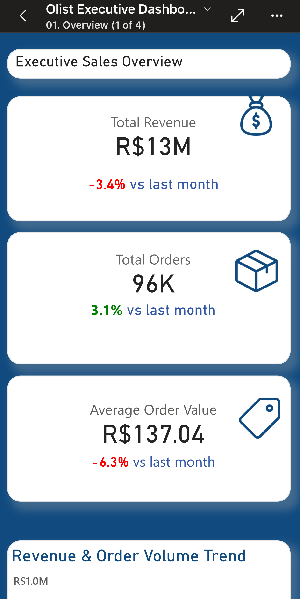

# 🚀 End-to-End Performance & Cost Optimization Strategy

!!! warning "Portfolio Scenario — Evidence Scope"
This file documents implemented optimization controls and benchmark evidence for a portfolio deployment. Benchmark numbers are tied to screenshots and captured runs in this repository.

!!! tip "Single Source of Truth"
Performance implementation details live in one place and are referenced here:

- Architecture and component boundaries: [01_architecture.md](01_architecture.md)
- MARTS contracts and grains: [02_data_dictionary.md](02_data_dictionary.md)
- Semantic model implementation and refresh details: [04_semantic_model.md](04_semantic_model.md)

---

## 1️⃣ Objective of This Document

Why performance matters in analytics systems:

- Fast dashboards protect user trust and increase adoption.
- Predictable refresh cycles keep KPI decisions timely.
- Compute guardrails prevent optimization gains from being erased by cost drift.

Performance vs usability trade-offs:

- Import mode gives low-latency visuals but uses scheduled freshness.
- Incremental strategies reduce refresh cost but require partition governance.
- Strong CI gates improve reliability but add feedback-loop overhead.

Target benchmarks used in this project:

- Dashboard load time: **< 2 seconds**
- Visual render time: **< 1200ms**
- Power BI refresh time: **< 10 minutes**
- Snowflake warehouse auto-suspend: **<= 60 seconds** for ingestion/transform

---

## 🟦 SECTION A — Snowflake Optimization

### A1. Warehouse sizing and suspend policy

**Decision:** X-SMALL warehouses for `LOADING_WH_XS`, `TRANSFORM_WH_XS`, and `REPORTING_WH_XS`.

**Action:**

- `AUTO_SUSPEND = 60` on loading and transform warehouses.
- `AUTO_SUSPEND = 300` on reporting warehouse to balance interactive reuse.
- Single-cluster limits (`MIN_CLUSTER_COUNT = 1`, `MAX_CLUSTER_COUNT = 1`) for cost discipline.

**Evidence:**

- SQL implementation: `02_snowflake/01_setup/01_infrastructure.sql` (warehouse section)
- Screenshot: [warehouse.png](screenshots/02_snowflake/warehouse.png)

### A2. Storage retention and table persistence strategy

**Decision:** Keep RAW cheap, keep analytics recoverable.

**Action:**

- `OLIST_RAW_DB` retention set to 0 days.
- `OLIST_ANALYTICS_DB` retention set to 1 day.
- RAW layer uses transient tables to minimize fail-safe overhead.

**Evidence:** `02_snowflake/01_setup/01_infrastructure.sql` (retention section)

### A3. Resource monitor and hard budget guardrails

**Problem:** Unbounded warehouse usage risk.

**Fix:** `OLIST_MONTHLY_LIMIT` with notify/suspend/suspend_immediate triggers.

**Impact:** Enforced compute ceiling and pre-limit alerting.

**Evidence:** `02_snowflake/01_setup/01_infrastructure.sql` (resource monitor section)

### A4. FinOps tagging for attribution

**Action:** Applied warehouse tags (`COST_CENTER`, `ENVIRONMENT`) on all three warehouses.

**Impact:** Cost slice by ingestion, transformation, and reporting workloads.

**Evidence:** `02_snowflake/01_setup/01_infrastructure.sql` (tagging section)

### A5. Environment isolation via zero-copy clone

**Action:** `OLIST_DEV_DB CLONE OLIST_ANALYTICS_DB` for development/test isolation.

**Impact:** Faster environment setup with lower storage overhead than full duplication.

**Evidence:** `02_snowflake/01_setup/01_infrastructure.sql` (clone section)

---

## 🟩 SECTION B — dbt Optimization

### B1. Materialization strategy by layer

**Decision log:**

- STAGING: `view`
- INTERMEDIATE: `ephemeral`
- MARTS dimensions: `table`
- MARTS facts: `incremental`

**Impact:** Low storage overhead upstream, low query latency in consumption layer.

**Evidence:** `03_dbt/dbt_project.yml` (models materialization section)

### B2. Incremental fact pipeline in MARTS

**Model:** `marts.sales.fct_order_items`

**Action:**

- `materialized='incremental'`
- `unique_key='order_item_sk'`
- `on_schema_change='append_new_columns'`
- Incremental filter driven by latest `order_date_dt` in target table.

**Evidence:**

- Model SQL: `03_dbt/models/marts/sales/fct_order_items.sql`
- Screenshot: [incremental_model.png](screenshots/03_dbt/incremental_model.png)

### B3. Query tagging and run observability

**Action:** dbt run-start hook sets Snowflake `QUERY_TAG` with environment + invocation id.

**Impact:** Traceable compute usage by run context.

**Evidence:** `03_dbt/dbt_project.yml` (on-run-start hook)

### B4. Parallel execution configuration

**Action:**

- `threads: 4` in `dev` and `ci`
- `threads: 8` in `prod`

**Impact:** Better wall-clock build performance while preserving role/warehouse controls.

**Evidence:** `03_dbt/profiles.yml`

### B5. Contract-first schemas and test gate scale

**Action:**

- Enforced schema contracts at marts layer.
- dbt test run artifact shows broad test coverage (including warnings tracked separately).

**Evidence:**

- Contract screenshot: [data_contracts.png](screenshots/03_dbt/data_contracts.png)
- Test evidence: [test_passed_suite.png](screenshots/03_dbt/test_passed_suite.png)
- Artifact: `03_dbt/target/run_results.json`

!!! info "Coverage Note"
Current run artifact includes a large automated suite with pass + warn outcomes; warnings are intentional for monitored anomalies, while blocking failures remain zero in successful CI passes.

### B6. CI execution scope and cleanup optimization

**Action:**

- CI triggers only on relevant dbt/workflow file changes.
- CI builds isolated schema (`CI_PR_<number>`).
- Post-run cleanup executes `drop_ci_schema` operation.

**Impact:** Lower waste compute and reduced orphaned-object overhead.

**Evidence:** `.github/workflows/ci_dbt_test.yaml`

---

## 🟨 SECTION C — Power BI Optimization

### C1. Storage mode decision

**Decision:** Import mode.

**Rationale:** Consistent low-latency interactions for target usage pattern.

**Evidence:** [04_semantic_model.md](04_semantic_model.md#51-storage-mode)

### C2. Incremental refresh policy

**Action:** Configured long archive with rolling refresh window and change detection.

**Measured benchmark (portfolio run):**

- Refresh time improvement from ~12m to ~2.5m
- Significantly lower transferred rows and Snowflake compute during refresh

**Evidence:**

- Config + benchmark notes: [04_semantic_model.md](04_semantic_model.md#52-data-refresh-strategy)
- Screenshot: [incremental_refresh.png](screenshots/04_powerbi/incremental_refresh.png)

### C3. Query folding discipline

**Action:** Keep transformation path foldable; validate with "View Native Query".

**Status:** Query folding validated for ingestion path used by the model.

**Evidence:** [query_folding.png](screenshots/04_powerbi/query_folding.png)

### C4. Star schema performance characteristics

**Action:** Single central fact with dimension-driven filters and one-to-many joins.

**Impact:** Lower visual query complexity vs denormalized many-join alternatives.

**Evidence:** [lineage_graph_view.png](screenshots/04_powerbi/lineage_graph_view.png)

### C5. Visual performance instrumentation

**Action:** Use Performance Analyzer traces as release evidence.

**Benchmark evidence:** [performance_analyzer_excutive_page.png](screenshots/04_powerbi/performance_analyzer_excutive_page.png)

---

## 🟪 SECTION D — UX Performance

### D1. Page complexity budget

**Action:** Keep each page scoped to high-signal visuals and move depth to drillthrough.

**Impact:** Faster first paint and improved user scan speed.

### D2. Drillthrough-first detail access

**Action:** Aggregated landing pages, detail pages loaded on demand.

**Evidence:** [drill_through_page.png](screenshots/04_powerbi/drill_through_page.png)

### D3. Mobile-specific layouts

**Action:** Dedicated mobile page composition, not desktop auto-shrink.

**Evidence:** [mobile_view.jpeg](screenshots/04_powerbi/mobile_view.jpeg)

### D4. Trust and UX instrumentation patterns

**Action:** Data-quality and trust affordances exposed in report UX.

**Evidence:** [trust_tooltip_ux.png](screenshots/04_powerbi/trust_tooltip_ux.png)

---

## 🟧 SECTION E — DataFinOps (Cost Optimization)

### E1. Compute cost controls

**Implemented controls:**

- Warehouse auto-suspend policies
- Resource monitor quota and suspend triggers
- Workload tags for attribution

**Primary evidence:**

- `02_snowflake/01_setup/01_infrastructure.sql`
- [warehouse.png](screenshots/02_snowflake/warehouse.png)

### E2. Storage cost controls

**Implemented controls:**

- RAW retention = 0 days
- Analytics retention = 1 day
- Transient-first RAW persistence pattern

**Evidence:** `02_snowflake/01_setup/01_infrastructure.sql` (retention section)

### E3. Refresh cost optimization

**Implemented controls:**

- Incremental fact processing in dbt
- Incremental refresh in Power BI

**Impact:** Lower recurring scan and transfer volume versus full rebuild/full refresh.

**Evidence:**

- [incremental_model.png](screenshots/03_dbt/incremental_model.png)
- [incremental_refresh.png](screenshots/04_powerbi/incremental_refresh.png)

### E4. CI cost optimization

**Implemented controls:**

- Path-filtered workflow triggers
- Isolated CI schema
- Post-build schema drop

**Evidence:** `.github/workflows/ci_dbt_test.yaml`

---

## 🟥 SECTION F — Monitoring & Alerting

### F1. Data freshness heartbeat

**Implementation:** `meta_project_status` singleton table with:

- `pipeline_last_run_at`
- `data_valid_through`

**Evidence:** `03_dbt/models/marts/meta/meta_project_status.sql`

### F2. CI quality gates and release telemetry

**Action:** PR checks enforce lint/build/test gates before merge.

**Evidence:**

- [ci_dbt_build_pass.png](screenshots/05_dataops/ci_dbt_build_pass.png)
- [github_pr_checks_pass.png](screenshots/05_dataops/github_pr_checks_pass.png)
- [sqlfluff_linting_pass.png](screenshots/05_dataops/sqlfluff_linting_pass.png)

### F3. BI runtime monitoring

**Action:** Performance Analyzer traces captured and reviewed as release evidence.

**Evidence:** [BPA_scan_after.png](screenshots/04_powerbi/BPA_scan_after.png)

### F4. Work tracking and issue visibility

**Action:** Optimization work tracked through issue and milestone artifacts.

**Evidence:**

- [github_issue_tracking.png](screenshots/05_dataops/github_issue_tracking.png)
- [project_milestones_roadmap.png](screenshots/05_dataops/project_milestones_roadmap.png)

---

## 17️⃣ Performance Comparison Table

| Area                                 | Before ❌             | After ✅                       | Measured Impact                        |
| ------------------------------------ | --------------------- | ------------------------------ | -------------------------------------- |
| Dashboard load (portfolio benchmark) | ~4s class experience  | ~1.8s class experience         | Meets sub-2s target on benchmark pages |
| Power BI refresh                     | Full refresh path     | Incremental refresh path       | ~79% faster benchmark refresh          |
| Refresh transfer volume              | Full table transfer   | Partition/window transfer      | Large reduction in transferred rows    |
| Snowflake idle burn                  | Longer active windows | 60s/300s suspend policy        | Significant idle-credit reduction      |
| dbt processing                       | Full-scan tendency    | Incremental fact + env threads | Lower recurring transform runtime      |
| Schema drift risk                    | Manual detection      | Contract + CI gate + lint      | Faster detection, safer releases       |

!!! note "Benchmark Integrity"
Numbers in this table are portfolio benchmark outputs from this repository’s evidence screenshots and docs. They are not presented as universal production constants.

---

## 🟦 SECTION H — Production Readiness Checklist

### Infrastructure

- [x] Warehouses sized and auto-suspend configured
- [x] Resource monitor with hard-stop triggers
- [x] Retention and transient storage policies applied
- [x] Cost attribution tags applied

### dbt Layer

- [x] Layer-wise materialization strategy implemented
- [x] Incremental marts fact implemented
- [x] Query tagging and thread tuning configured
- [x] Contracts/tests/lint in CI gates

### Power BI Layer

- [x] Import mode selected and justified
- [x] Incremental refresh configured
- [x] Query folding validated
- [x] Performance Analyzer evidence captured

### Monitoring + Ops

- [x] Freshness heartbeat table deployed
- [x] CI pass evidence retained
- [x] Issue/milestone tracking artifacts maintained
- [x] Runbook references in place

---

## Summary

Optimization coverage spans warehouse policy, dbt execution design, semantic refresh strategy, UX-level interaction design, and DataFinOps controls. The performance posture is implemented end-to-end with repository-backed evidence, not isolated point fixes.
