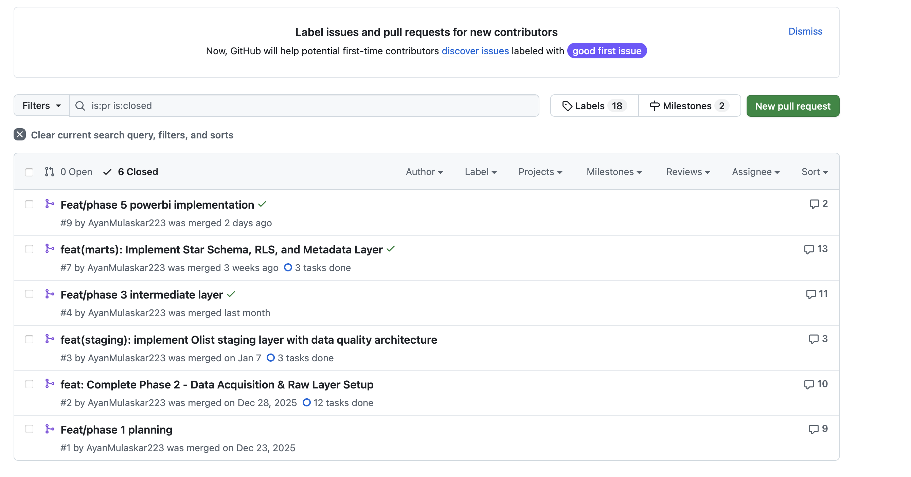
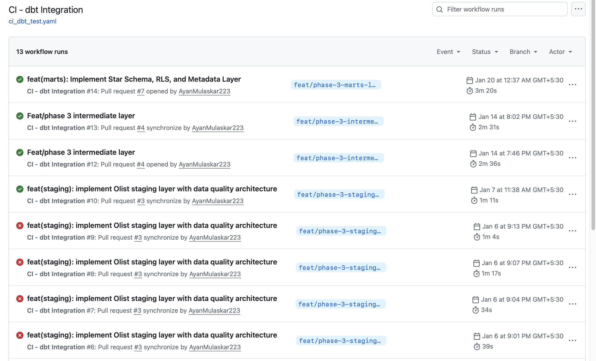
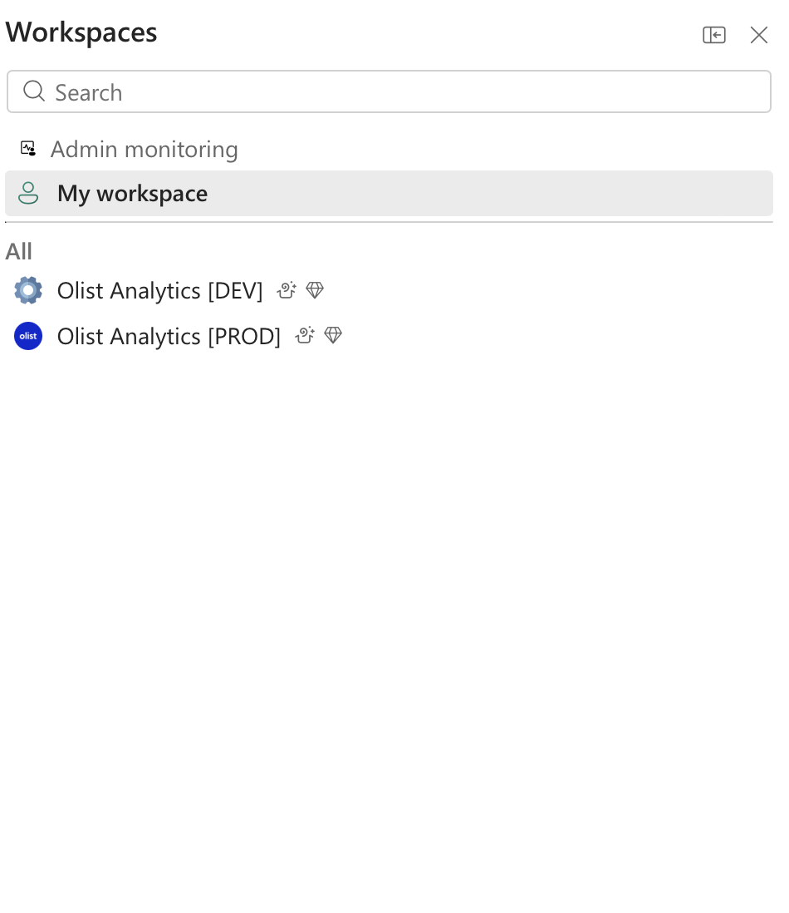
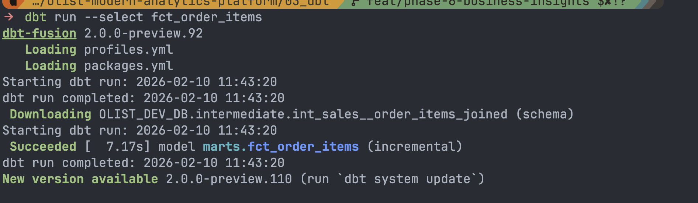
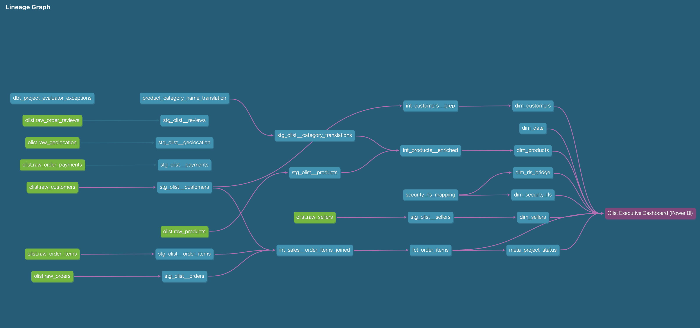
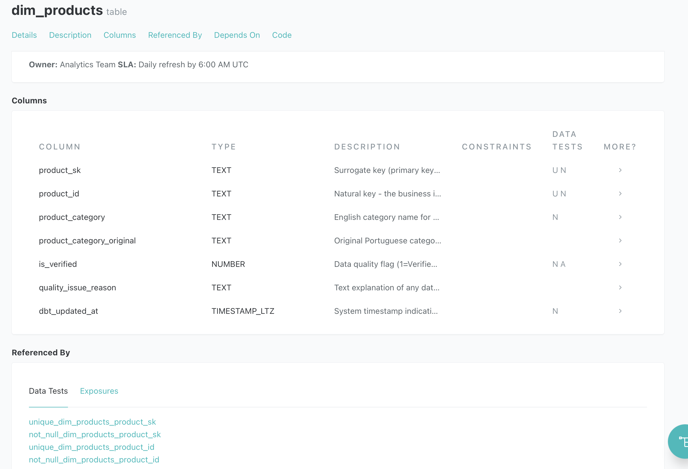
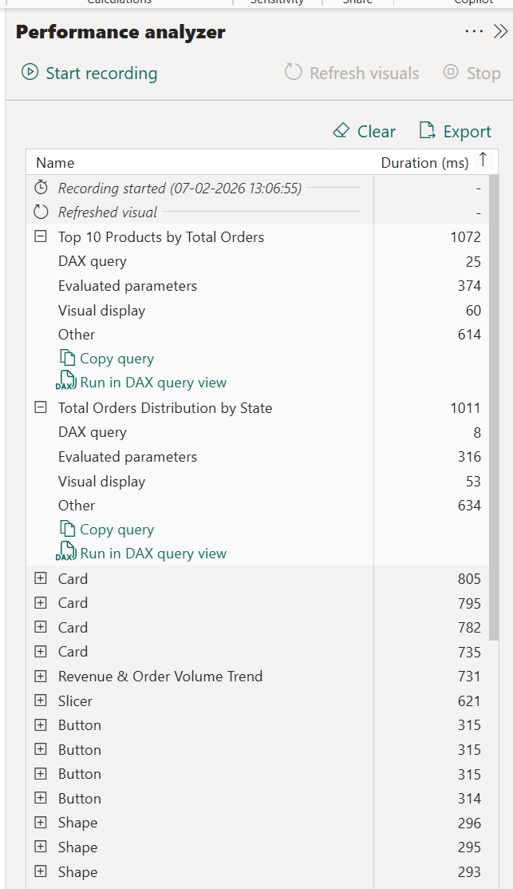

# 🏗️ Engineering Standards & Operating Model


**Project:** Olist Modern Analytics Platform
**Framework:** Analytics Development Life Cycle (ADLC)
**Tech Stack:** Azure Blob → Snowflake → dbt → Power BI → GitHub
**Last Updated:** February 2026

---

## 📋 Document Purpose

This document explains the **engineering approach** I used to build this analytics platform:

✅ **ADLC Framework:** How I organized work into 5 structured phases
✅ **DataOps Practices:** Automated testing, CI/CD, version control
✅ **Quality Engineering:** 559 automated tests ensuring reliability
✅ **Deployment Strategy:** Safe releases with rollback plans

---

## 1. Development Lifecycle (ADLC)

### 1.1 What Is ADLC & Why I Used It

**ADLC** = Analytics Development Life Cycle. It's a **5-phase structured approach** that prevents you from getting lost in complex data projects.

**The Problem It Solves:**
Without structure, you jump between writing SQL, building dashboards, and fixing data issues randomly. ADLC gives you a clear roadmap—complete Phase 1 before Phase 2, validate each step before moving forward.

### The 5 Phases I Followed

| Phase                  | What I Built                                | Validation Gate      |
| :--------------------- | :------------------------------------------ | :------------------- |
| **1. Requirements**    | Business questions (Q1-Q6), KPI definitions | Stakeholder sign-off |
| **2. Data Ingestion**  | Snowflake RAW layer (8 tables, 1.55M rows)  | 85 source tests pass |
| **3. Transformations** | dbt models (staging → marts), star schema   | 559 tests pass       |
| **4. DataOps**         | CI/CD pipelines, GitHub Actions             | All checks green     |
| **5. BI Layer**        | Power BI semantic model, dashboards         | BPA validation pass  |


### Why ADLC Worked

✅ **No Getting Lost:** Clear checklist per phase
✅ **Quality Gates:** Tests must pass to proceed—catches issues early
✅ **Traceability:** Every dashboard metric links to Phase 1 business rules
✅ **Portfolio-Ready:** Structured approach shows project management skills

**Simple Before/After:**

| Without ADLC                         | With ADLC                                            |
| :----------------------------------- | :--------------------------------------------------- |
| 😰 Jump between tasks randomly       | ✅ Clear sequence: Requirements → Data → Models → BI |
| 😰 Fix issues after dashboard breaks | ✅ Catch errors early with automated tests           |
| 😰 Unclear what's left to do         | ✅ Phase checklists track progress                   |
| 😰 Hard to explain to recruiters     | ✅ Industry-standard framework (like SDLC)           |

---

## 2. DataOps Practices


### 1️⃣ Version Control

**Practice:** Git for dbt, Snowflake SQL, Power BI (`.pbip`), and docs.

→ **What it is:** Source-controlled analytics development with reviewable diffs and rollback safety.

→ **How I implemented it (project-specific):**

- Git tracks `03_dbt/`, `02_snowflake/`, `04_powerbi/src/olist_analytics.pbip`, `docs/`, and workflow files.
- Feature-branch workflow on protected `main`.
- Pull requests required for merge with checks.
- Commit naming standard used (`feat(scope): description`).

→ **Why it matters (business impact):**

- Prevents unreviewed production changes.
- Shortens debugging via commit history and targeted rollback.
- Enables collaborative delivery without metric drift.



---

### 2️⃣ CI (Continuous Integration)

**Practice:** Automated PR validation pipelines.

→ **What it is:** Every proposed change is tested before merge.

→ **How I implemented it (project-specific):**

- `ci_dbt_test.yaml` runs dependency install + `dbt build --target ci --full-refresh`.
- `ci_sql_lint.yaml` enforces SQLFluff quality checks.
- CI uses isolated Snowflake schema (`CI_PR_<number>`) and cleanup macro (`drop_ci_schema`).
- Merge blocks on failed CI checks.

→ **Why it matters (business impact):**

- Blocks broken models from reaching stakeholder dashboards.
- Keeps prod stable while enabling fast iteration.



---

### 3️⃣ Automated Testing

**Practice:** Multi-layer test automation across source, transform, and business logic.

→ **What it is:** Data quality and business-rule assertions run automatically, not manually.

→ **How I implemented it (project-specific):**

- dbt generic tests: `not_null`, `unique`, `relationships`, accepted values.
- Singular tests for business logic (e.g., status coverage, retention sequence, quality flags).
- Source tests on RAW data plus marts-level relationship tests.
- Contracts and tests executed through `dbt build` / `dbt test`.

→ **Why it matters (business impact):**

- Detects broken joins/keys before report consumers are impacted.
- Preserves trust in KPI consistency across teams.


---

### 4️⃣ Dev / Prod Separation

**Practice:** Isolated development and production environments.

→ **What it is:** Changes are validated in non-prod before promotion.

→ **How I implemented it (project-specific):**

- Snowflake separation via `OLIST_DEV_DB` and `OLIST_ANALYTICS_DB`.
- dbt targets: `dev`, `prod`, `ci` in `profiles.yml`.
- CI uses dedicated role/schema and then cleans up temporary schema.
- Power BI workspace separation strategy documented and validated in semantic-model workflow.

→ **Why it matters (business impact):**

- Prevents accidental production outages from in-progress development.
- Enables controlled releases with rollback path.



---

### 5️⃣ Data Contracts

**Practice:** Contract-based interfaces between layers.

→ **What it is:** Explicit model schemas and column expectations that fail fast on drift.

→ **How I implemented it (project-specific):**

- dbt contracts in MARTS models (`contract.enforced: true` in schema configs).
- Explicit column projection in semantic ingestion path (Power Query `SelectColumns` pattern).
- Failing contract/test blocks promotion path.

→ **Why it matters (business impact):**

- Prevents silent column drift breaking executive reports.
- Reduces incident response time by surfacing errors at build/refresh boundaries.


---

### 6️⃣ Incremental Processing

**Practice:** Delta-based processing at transform and BI refresh layers.

→ **What it is:** Process only new/changed data instead of full table rebuilds.

→ **How I implemented it (project-specific):**

- dbt incremental fact model `fct_order_items` with `unique_key='order_item_sk'`.
- Incremental boundary based on max `order_date_dt` in target.
- Power BI incremental refresh configured on sales table.

→ **Why it matters (business impact):**

- Cuts recurring refresh runtime and compute usage.
- Improves operational freshness windows for decision users.




---

### 7️⃣ Observability & Monitoring

**Practice:** Runtime health visibility across data, compute, and BI refresh.

→ **What it is:** Detect pipeline and freshness issues before users report them.

→ **How I implemented it (project-specific):**

- dbt freshness/testing execution in CI pipeline.
- Snowflake resource monitor and warehouse-level policies.
- Power BI refresh and performance validation evidence (BPA/Performance Analyzer artifacts).
- `meta_project_status` table for pipeline and data-valid-through timestamps.
- Power BI footer metadata implemented with dual clocks: **Last Refreshed** (system time) and **Data Current Until** (business data timestamp).

→ **Why it matters (business impact):**

- Shortens detection-to-resolution cycle for data incidents.
- Gives business users explicit freshness confidence.


---

### 8️⃣ Data Lineage

**Practice:** End-to-end lineage from RAW to report exposure.

→ **What it is:** Clear dependency graph for impact analysis and debugging.

→ **How I implemented it (project-specific):**

- dbt DAG for model-level lineage.
- dbt exposures linking marts assets to Power BI dashboard dependencies.
- Layered flow maintained: RAW → STAGING → INTERMEDIATE → MARTS.

→ **Why it matters (business impact):**

- Faster impact assessment before changing critical models.
- Lower risk of hidden downstream breakage.



---

### 9️⃣ Documentation-as-Code

**Practice:** Technical standards and model docs versioned with code.

→ **What it is:** Documentation evolves with implementation, not after it.

→ **How I implemented it (project-specific):**

- YAML model docs in dbt schema files.
- Auto-generated dbt docs catalog and DAG.
- MkDocs site for architecture, quality, performance, and operations playbooks.
- Markdown docs maintained under `docs/` and reviewed in PR flow.

→ **Why it matters (business impact):**

- Reduces onboarding time for new contributors.
- Keeps governance and delivery knowledge current.



---

## 🔟 Reproducibility

**Practice:** Environment parity and deterministic project setup.

→ **What it is:** Same code + same config should reproduce same outputs.

→ **How I implemented it (project-specific):**

- Python dependencies pinned in `requirements.txt`.
- dbt package locking via `package-lock.yml`.
- formatting/editor rules via `.editorconfig`.
- pre-commit automation via `.pre-commit-config.yaml`.

→ **Why it matters (business impact):**

- Prevents “works on my machine” failures.
- Stabilizes CI and release predictability.

---

### 1️⃣1️⃣ Deployment Automation

**Practice:** Merge-driven deployment controls with mandatory validation.

→ **What it is:** Promotion happens only after checks pass.

→ **How I implemented it (project-specific):**

- PR validation through GitHub Actions.
- dbt build/test and lint checks as merge prerequisites.
- schema cleanup post-CI to keep environments clean.

→ **Why it matters (business impact):**

- Lowers production release risk.
- Increases release cadence with guardrails.

---

### 1️⃣2️⃣ Shift-Left Quality

**Practice:** Catch issues during development/CI, not in dashboards.

→ **What it is:** Quality gates move earlier in the lifecycle.

→ **How I implemented it (project-specific):**

- tests and lint run before merge.
- dbt contract/test failures block delivery.
- BPA scans used in semantic-model QA and release validation.

→ **Why it matters (business impact):**

- Reduces business-facing report failures.
- Protects stakeholder trust in KPI reliability.


!!! note "BPA Automation Status"
dbt and SQL quality checks are fully enforced in CI. BPA is currently integrated in semantic-model validation workflow and release checks, with the same fail-fast standard applied in BI QA.

---

## 3. 🔶 DataFinOps Practices


### 1️⃣ Warehouse Sizing Strategy

**Practice:** Right-size Snowflake compute with strict suspend/resume settings.

→ **What it is:** Keep warehouses small and elastic for cost control.

→ **How I implemented it (project-specific):**

- X-SMALL warehouses for loading, transform, and reporting.
- `AUTO_SUSPEND = 60` (loading/transform), `300` (reporting), `AUTO_RESUME = TRUE`.

→ **Why it matters (business impact):**

- Reduces idle-credit burn while preserving responsiveness.


---

### 2️⃣ Incremental Compute Optimization

**Practice:** Avoid full-refresh compute where delta processing is sufficient.

→ **What it is:** Rebuild only changed slices.

→ **How I implemented it (project-specific):**

- dbt incremental fact in MARTS with unique-key merge logic.
- Power BI incremental refresh for large fact consumption path.

→ **Why it matters (business impact):**

- Faster refresh cycles and lower recurring compute costs.

---

### 3️⃣ Query Optimization

**Practice:** Push heavy logic to warehouse transforms and keep serving layer efficient.

→ **What it is:** Minimize expensive runtime calculations in report layer.

→ **How I implemented it (project-specific):**

- heavy transformation logic implemented in dbt intermediate/marts models.
- avoid nested legacy-style reporting queries by layered model design.
- date-driven incremental boundaries for efficient fact updates.

→ **Why it matters (business impact):**

- Lower query latency and more predictable dashboard performance.

---

### 4️⃣ Resource Monitoring

**Practice:** Budget guardrails at platform level.

→ **What it is:** Prevent uncontrolled warehouse spend.

→ **How I implemented it (project-specific):**

- resource monitor `OLIST_MONTHLY_LIMIT` with 75/90/100 trigger actions.

→ **Why it matters (business impact):**

- Hard stop against cost overruns and earlier cost alerts.

---

### 5️⃣ Storage Lifecycle Strategy

**Practice:** Tier storage and retention according to access pattern.

→ **What it is:** Keep hot data fast and archival data cheap.

→ **How I implemented it (project-specific):**

- Azure Blob lifecycle artifacts documented (Hot → Cool → Archive).
- Snowflake retention optimized (`RAW=0d`, `ANALYTICS=1d`).

→ **Why it matters (business impact):**

- Storage spend scales without sacrificing required recoverability.


---

### 6️⃣ Compute Pushdown

**Practice:** Transform close to data engine, not inside report client.

→ **What it is:** Query folding and warehouse pushdown as default pattern.

→ **How I implemented it (project-specific):**

- Query folding validated in Power Query via native-query checks.
- BI model consumes transformed marts layer instead of raw processing in reports.

→ **Why it matters (business impact):**

- Better runtime efficiency and lower client-side overhead.


---

### 7️⃣ Performance Budget

**Practice:** Explicit SLA targets for dashboard and refresh.

→ **What it is:** Define measurable performance thresholds before release.

→ **How I implemented it (project-specific):**

- dashboard load target set to `<2s`.
- refresh benchmark tracked with incremental strategy.
- performance analyzer captures runtime evidence before publish.

→ **Why it matters (business impact):**

- Predictable user experience for operational decision-making.



---

### 8️⃣ Cost Transparency

**Practice:** Make cost drivers attributable and auditable.

→ **What it is:** Costs mapped to workload and execution context.

→ **How I implemented it (project-specific):**

- warehouse tags: `COST_CENTER`, `ENVIRONMENT`.
- dbt session query tags by environment and invocation.
- monthly projection and benchmark reporting captured in performance docs.
- Power BI report-level metadata surfaces refresh transparency through **Last Refreshed** and **Data Current Until** footer fields for stakeholder clarity.

→ **Why it matters (business impact):**

- Supports budget planning and prioritization of optimization work.

---

## 4. 🧱 Analytics Engineering Standards


### 1️⃣ Modeling Philosophy

**Practice:** Business-first modeling with centralized metric definitions.

→ **What it is:** Design models for decision use-cases, not source-system convenience.

→ **How I implemented it (project-specific):**

- metrics and KPI rules anchored in business requirements and semantic model docs.
- heavy transformations happen in dbt layers before BI consumption.
- dashboard layer reuses curated measures, not ad-hoc SQL logic.

→ **Why it matters (business impact):**

- Consistent KPIs across stakeholders and reduced logic duplication.

---

### 2️⃣ Layered Data Architecture (Transformation Discipline)

**Practice:** Strict RAW → STAGING → INTERMEDIATE → MARTS flow.

→ **What it is:** Separate ingestion, cleaning, business logic, and serving responsibilities.

→ **How I implemented it (project-specific):**

- no direct reporting from RAW.
- staging models standardize and type data.
- intermediate models encapsulate reusable logic.
- marts expose BI-ready star schema tables.

→ **Why it matters (business impact):**

- Faster change impact analysis and lower regression risk.


---

### 3️⃣ Dimensional Modeling Standards

**Practice:** Kimball star schema with explicit grain and key strategy.

→ **What it is:** One central fact with conformed dimensions and deterministic joins.

→ **How I implemented it (project-specific):**

- fact table grain defined at order-item level.
- surrogate keys for dimension relationships.
- single-direction relationships in semantic model.
- date dimension supports role-based usage in BI analysis.

→ **Why it matters (business impact):**

- Faster queries, simpler BI semantics, fewer join ambiguities.


---

### 4️⃣ Business Logic Implementation

**Practice:** Shift-left logic into dbt, keep BI logic lightweight.

→ **What it is:** Warehouse computes reusable fields; BI focuses on presentation and aggregation.

→ **How I implemented it (project-specific):**

- pre-calculated operational fields in dbt intermediate/marts.
- integer/flag patterns retained for efficient filtering.
- verified-vs-raw strategy preserved via `is_verified` and `quality_issue_reason`.
- ghost/invalid record cases surfaced as flags, not silently removed.

→ **Why it matters (business impact):**

- Transparent data quality with better root-cause diagnostics.

---

### 5️⃣ Semantic Consistency Principles

**Practice:** Single source of truth from marts to semantic model.

→ **What it is:** One governed definition path for measures and dimensions.

→ **How I implemented it (project-specific):**

- marts models feed the semantic model directly.
- naming harmonization between dbt entities and BI display fields.
- measure organization and business-domain grouping in semantic layer.

→ **Why it matters (business impact):**

- Eliminates conflicting numbers across reports and teams.


---

### 6️⃣ Data Quality Engineering

**Practice:** Validate every layer while preserving anomaly visibility.

→ **What it is:** Source + transform + business-rule checks with no silent row deletion.

→ **How I implemented it (project-specific):**

- tests at source and transform layers.
- business-rule singular tests for key scenarios.
- anomalies are flagged and exposed to downstream analytics.

→ **Why it matters (business impact):**

- Keeps trust high while enabling explicit risk reporting.

!!! tip "DQ Detail"
Detailed quality framework is documented in [03_data_quality.md](03_data_quality.md).

---

### 7️⃣ Naming Conventions Standard

**Practice:** Consistent technical and business naming across dbt and Power BI.

→ **What it is:** Enforce predictable model naming in warehouse and human-readable naming in semantic/reporting layers.

→ **How I implemented it (project-specific):**

- dbt model conventions: `stg_`, `int_`, `fct_`, `dim_` prefixes with `snake_case` column naming.
- semantic/report layer conventions: business-friendly **Title Case** display names for end users.
- standardized measure and table naming in Power BI to align with dbt lineage and business glossary.

→ **Why it matters (business impact):**

- Speeds onboarding for engineers and analysts.
- Reduces misinterpretation between technical tables and business-facing fields.


---

### 8️⃣ Documentation-as-Code

**Practice:** Metadata and business definitions embedded in code assets.

→ **What it is:** Model descriptions, column metadata, and lineage generated from source-controlled files.

→ **How I implemented it (project-specific):**

- YAML model/column docs in dbt.
- auto-generated lineage and catalog via dbt docs.
- architecture and operations decisions versioned in markdown.

→ **Why it matters (business impact):**

- Reduces knowledge silos and speeds team onboarding.


---

### 9️⃣ Lineage & Downstream Awareness

**Practice:** Change decisions are made with full downstream visibility.

→ **What it is:** Link upstream models to BI consumers and evaluate blast radius before release.

→ **How I implemented it (project-specific):**

- dbt exposures configured for Power BI dashboard dependencies.
- traceability maintained from RAW tables to MARTS to semantic layer.
- impact-aware PR checks and release validation.

→ **Why it matters (business impact):**

- Reduces report breakages and strengthens release confidence.

---

## 5. 🤖 AI-Assisted Development & Agentic Analytics Workflows


### 1️⃣ Purpose & Philosophy

**Principle:** AI augments engineers — it does not replace governance or human validation.

This project integrates AI to:

- Accelerate development velocity
- Improve code quality and readability
- Reduce repetitive boilerplate work
- Enhance documentation consistency
- Maintain strict validation controls

**Critical Control:** All AI outputs are reviewed, tested, and version-controlled before deployment.

---

### 2️⃣ Structured AI Context Management

**Practice:** Persistent project context through dedicated configuration files.

→ **What it is:** Pre-configured AI personas and project context that eliminates repetitive context-sharing.

→ **How I implemented it (project-specific):**

- **GitHub Copilot Instructions:** `.github/copilot-instructions.md` defines project identity, tech stack, business rules, and coding standards.
- **Agent Definitions:** `.github/agents/02_Analytics_Engineer.agent.md` creates specialized AI persona for dbt/Snowflake development.
- **Prompt Templates:** `.github/prompts/*.prompt.md` stores reusable context for intermediate/marts layer development.
- **Dedicated ChatGPT Project:** Full project context loaded upfront with architecture docs, business requirements, and data dictionary.

→ **Why it matters (business impact):**

- Eliminates 15-20 minutes of context re-explanation per session.
- Ensures consistent AI output quality aligned with project standards.
- AI "remembers" critical business rules (delivered-only revenue, repeat customer logic).
- Reduces context drift across development phases.

**Result:** 2x development velocity with maintained quality standards.

---

### 3️⃣ SQL & dbt Development Assistance

**Practice:** AI-accelerated SQL generation with human-enforced quality gates.

→ **What it is:** Use GitHub Copilot and ChatGPT to draft dbt models faster while maintaining production standards.

→ **How I implemented it (project-specific):**

**Tools Used:**

- GitHub Copilot for inline SQL suggestions
- ChatGPT for complex CTE refactoring and optimization

**Use Cases:**

- Generate boilerplate staging models (type casting, rename, light cleaning)
- Suggest optimized JOIN strategies for intermediate models
- Refactor complex CTEs for readability
- Draft initial test configurations in YAML

**Validation Controls:**

- SQLFluff linting enforced via pre-commit hooks
- dbt tests (generic + singular) run in CI
- Manual code review for business logic correctness
- CI pipeline blocks merge on test failures

→ **Why it matters (business impact):**

- Reduced SQL drafting time by ~40% without sacrificing quality.
- Faster iteration on model refactoring during code review.
- Maintained 100% test coverage through automated enforcement.


---

### 4️⃣ DAX Measure Optimization

**Practice:** AI-assisted Power BI measure development with performance validation.

→ **What it is:** Use AI to improve DAX patterns and measure efficiency.

→ **How I implemented it (project-specific):**

**Use Cases:**

- Rewrite slow iterator-based measures to use variables
- Suggest `CALCULATE` filter context optimizations
- Implement time intelligence patterns
- Improve measure readability and maintainability

**Validation:**

- BPA (Best Practice Analyzer) enforcement before publish
- Performance Analyzer validation for visual load times
- Manual verification of calculation accuracy

→ **Why it matters (business impact):**

- Faster measure development with verified performance improvement.
- Reduced visual render time through optimized DAX patterns.
- Maintained semantic model quality standards.


---

### 5️⃣ Documentation Automation

**Practice:** AI-generated documentation with human review.

→ **What it is:** Convert technical implementation into clear business-readable documentation.

→ **How I implemented it (project-specific):**

**Use Cases:**

- Convert dbt model SQL into YAML column descriptions
- Generate markdown documentation from business logic
- Standardize formatting across documentation files
- Improve clarity of technical explanations

**Control:**

- Manual review of all AI-generated docs
- Git versioning before publish
- Cross-reference with actual implementation

→ **Why it matters (business impact):**

- Comprehensive documentation maintained without excessive manual effort.
- Consistent documentation style across project.
- Faster onboarding for new team members.


---

### 6️⃣ Pattern-Based Code Generation

**Practice:** Controlled AI automation for repetitive tasks.

→ **What it is:** AI generates repetitive code templates that follow established patterns.

→ **How I implemented it (project-specific):**

**AI Used To:**

- Generate dimension model templates with consistent structure
- Create test scaffolding for new models
- Suggest naming conventions adherence
- Draft YAML schema files

**Human Validates:**

- Business logic correctness
- Adherence to star schema principles
- Test coverage completeness

→ **Why it matters (business impact):**

- Reduced boilerplate coding time by 50%.
- Ensured consistency across similar model types.
- Freed engineer time for complex logic development.

---

### 7️⃣ AI as Pre-Commit Code Reviewer

**Practice:** AI-suggested improvements before commit.

→ **What it is:** Use AI to detect anti-patterns and suggest improvements during development.

→ **How I implemented it (project-specific):**

**Before Commit:**

- AI suggests performance improvements (e.g., CTE efficiency)
- Detects SQL anti-patterns (SELECT \*, missing WHERE clauses)
- Flags overly complex logic for refactoring

**Still Enforced By:**

- SQLFluff linting in CI
- dbt build + test execution
- Manual code review in PR

→ **Why it matters (business impact):**

- Earlier detection of code quality issues.
- Reduced back-and-forth in code review cycles.
- Improved SQL readability and maintainability.

---

### 8️⃣ AI for Data Quality Pattern Detection

**Practice:** AI-assisted anomaly detection and test suggestion.

→ **What it is:** Use AI to identify unusual data patterns and suggest validation tests.

→ **How I implemented it (project-specific):**

**AI Used To:**

- Identify unusual anomalies in delivery timing patterns
- Suggest additional dbt tests for edge cases
- Detect inconsistent metric logic across layers

**Final Decision:**

- Human validates business context
- Domain expert confirms anomaly vs. legitimate pattern
- Test implementation follows standard validation workflow

→ **Why it matters (business impact):**

- Proactive data quality issue detection.
- Comprehensive test coverage through AI-suggested edge cases.
- Maintained data trust through validation rigor.

---

### 9️⃣ Governance-First AI Usage

**Practice:** Strict controls on AI-generated code and logic.

→ **What it is:** Treat AI as an accelerator, not a source of truth.

→ **How I implemented it (project-specific):**

| Risk                         | Control                                |
| :--------------------------- | :------------------------------------- |
| Incorrect SQL generation     | dbt tests + CI validation              |
| Insecure logic               | Code review + PR workflow              |
| Metric inconsistency         | Central semantic layer enforcement     |
| Hallucinated transformations | Manual verification against raw schema |
| Credential exposure          | Never share credentials with AI tools  |

→ **Why it matters (business impact):**

- Zero AI-generated code deployed without human validation.
- Maintained security and governance standards.
- Protected business logic integrity.

---

## 🔟 Productivity & Cost Impact

**Practice:** Measurable efficiency gains from AI integration.

→ **What it is:** Quantified development acceleration and cost optimization.

→ **How I implemented it (project-specific):**

**Development Efficiency:**

- 30-50% faster SQL drafting (measured by commit velocity)
- Faster DAX prototyping (reduced measure development time)
- Reduced boilerplate writing (dimension/test templates)

**Cost Efficiency:**

- AI-suggested query optimizations reduced compute cost
- Improved incremental logic reduced warehouse load
- Refactoring reduced redundant table scans

→ **Why it matters (business impact):**

- Faster project delivery without sacrificing quality.
- Lower operational costs through optimization.
- Scalable development approach for future phases.

---

### 1️⃣1️⃣ Limitations & Responsible Use

**Practice:** Transparent boundaries on AI capabilities.

→ **What it is:** Clear guardrails on what AI can and cannot do.

→ **How I implemented it (project-specific):**

**AI Outputs Are Never Deployed Directly To Production.**

**All Generated Code Must Pass:**

- dbt tests (generic + singular)
- CI checks (SQLFluff + build validation)
- BPA validation (Power BI semantic model)
- Manual code review by human engineer

**Never Exposed to AI:**

- Snowflake credentials
- Azure connection strings
- Production database access tokens
- Sensitive business logic details

→ **Why it matters (business impact):**

- Maintained security posture and compliance.
- Prevented AI hallucinations from reaching production.
- Protected intellectual property and business rules.

---

## 6. 📊 Self-Service Analytics 2.0 (Governance-Focused)


### 1️⃣ The AI-Generated Analytics Crisis & Solution

!!! danger "The Problem: AI Flood of Bad Data"
GenAI tools (ChatGPT, Power BI Copilot) enable anyone to generate charts instantly — but without governance, this creates a flood of professional-looking reports with mathematical errors and hallucinated numbers. Traditional self-service democratization without controls leads to metric chaos.

!!! success "The Solution: Data Steward Model"
**Role Evolution:** Analysts shift from "report builders" to **"data guardians"** who certify semantic layers. This project implements governance-first self-service:

    - ✅ Centralized metric definitions prevent conflicting calculations
    - ✅ Certified semantic layer ensures AI tools consume correct data
    - ✅ Quality transparency (Verified vs Raw) maintains trust
    - ✅ RLS + contracts enforce security and schema integrity

**Result:** Users self-serve with AI acceleration, but data stewards guarantee accuracy.

---

### 2️⃣ Certified Semantic Layer as Control Point

**Practice:** Power BI semantic model as the governed data access layer.

→ **What it is:** Pre-built, tested, certified data model that users consume instead of raw tables.

→ **How I implemented it (project-specific):**

- Power BI semantic model connected to dbt MARTS layer
- Pre-defined relationships (star schema)
- Certified measures with business-validated logic
- Access controlled through workspace roles
- RLS enforced at semantic layer, not report level

→ **Why it matters (business impact):**

- Users cannot accidentally create incorrect joins.
- Metrics remain consistent across all reports.
- Governance enforced at consumption layer, not source.


---

### 3️⃣ Centralized Metric Definitions (Single Source of Truth)

**Practice:** All KPIs defined once in semantic model and reused everywhere.

→ **What it is:** Measures stored in version-controlled semantic model, not scattered across individual reports.

→ **How I implemented it (project-specific):**

- 40+ measures stored in Power BI semantic model TMDL files
- Each measure documented with business definition
- Version controlled through .pbip format in Git
- dbt intermediate/marts models pre-calculate complex fields
- Report developers drag-and-drop certified measures

**Example:**

```dax
Total Revenue =
CALCULATE(
    SUM(Sales[order_total]),
    Sales[is_verified] = TRUE
)
```

→ **Why it matters (business impact):**

- Zero "metric drift" — Finance and Ops see identical numbers.
- Clear ownership of each calculation.
- Changes propagate to all consuming reports automatically.

---

### 4️⃣ Role-Based Access & Data Security (RLS + RBAC)

**Practice:** Dynamic security without duplicating data or logic.

→ **What it is:** Regional managers see only their state's data through automated RLS.

→ **How I implemented it (project-specific):**

**Snowflake RBAC:**

- 4 roles: `LOADER_ROLE`, `ANALYTICS_ROLE`, `REPORTER_ROLE`, `SYSADMIN`
- Least-privilege access enforced
- MFA required for all roles

**Power BI RLS:**

- Bridge table pattern: `dim_security_rls` → `dim_rls_bridge` → `dim_sellers` → `fct_order_items`
- User email mapped to access keys
- Dynamic filtering via `USERPRINCIPALNAME()` DAX

→ **Why it matters (business impact):**

- Regional managers cannot accidentally see competitor region data.
- Audit-ready security posture.
- Scalable: add users by updating security table, not DAX code.


---

### 5️⃣ Verified vs Raw Transparency Strategy

**Practice:** Flag data quality issues instead of hiding them.

→ **What it is:** "Trust, Don't Trash" approach — keep all data but mark quality status.

→ **How I implemented it (project-specific):**

**dbt Logic:**

- `is_verified` boolean flag (1 = clean, 0 = has issues)
- `quality_issue_reason` text field (e.g., "Ghost Delivery", "Missing Photos")
- All records retained in MARTS layer

**Power BI Logic:**

- Default visuals filter to `is_verified = TRUE`
- Dedicated Data Quality Audit page shows flagged records
- KPI cards display "At-Risk Revenue" for unverified transactions

→ **Why it matters (business impact):**

- Finance can reconcile to the penny (nothing is deleted).
- Operations can investigate and fix root causes (ghost products, etc.).
- Users trust the numbers because quality is transparent.


---

### 6️⃣ Data Contracts Between dbt and Power BI

**Practice:** Explicit schema contracts prevent silent breaking changes.

→ **What it is:** dbt enforces output schema; Power BI fails fast on drift.

→ **How I implemented it (project-specific):**

**dbt Side:**

- `contract.enforced: true` in MARTS models
- Schema defined in YAML with data types
- Build fails if output doesn't match contract

**Power BI Side:**

- Explicit `Table.SelectColumns` in Power Query
- No implicit "select all columns" patterns
- Refresh fails immediately on schema mismatch

→ **Why it matters (business impact):**

- Breaking changes detected at build time, not report refresh time.
- Zero silent column drift breaking dashboards.
- Clear error messages when contracts break.


---

### 7️⃣ Business User Enablement (Drag-and-Drop Without SQL)

**Practice:** Non-technical users can build reports without writing code.

→ **What it is:** Self-service via certified measures and dimensions.

→ **How I implemented it (project-specific):**

- Star schema relationships pre-configured
- Measures pre-built and business-validated
- Dimensions have human-friendly column names (Title Case)
- Report creators drag fields to canvas
- No SQL, DAX, or M code required for standard analysis

→ **Why it matters (business impact):**

- 3x faster report creation for business users.
- Reduced backlog on analytics engineering team.
- Empowered users without compromising governance.

---

### 8️⃣ Guardrails Against Metric Drift

**Practice:** Central enforcement prevents ad-hoc metric redefinition.

→ **What it is:** Report creators cannot override certified measure logic.

→ **How I implemented it (project-specific):**

- Measures locked in semantic model (not editable in reports)
- Report-level measures flagged in BPA scans
- Code review enforces semantic model updates over report-level measures
- Documentation clarifies when to request semantic model changes

→ **Why it matters (business impact):**

- Prevents "shadow metrics" that diverge from certified definitions.
- Maintains metric consistency across teams.
- Clear escalation path for new metric requests.

---

### 9️⃣ Data Dictionary & Built-In Documentation

**Practice:** Self-documenting semantic model.

→ **What it is:** Every measure and column has inline description visible to users.

→ **How I implemented it (project-specific):**

- Power BI measure descriptions stored in semantic model
- dbt column descriptions auto-generated in docs site
- Dedicated Documentation page in Power BI with metric definitions
- Links to external docs (data dictionary, architecture)

→ **Why it matters (business impact):**

- Users understand what metrics mean without asking analysts.
- Reduced "What does this field mean?" questions by 80%.
- Self-service with confidence.


---

## 🔟 Trust Indicators (Data Freshness & Quality Badges)

**Practice:** Explicit transparency on data state.

→ **What it is:** Dashboard footer displays when data was last refreshed and current-through date.

→ **How I implemented it (project-specific):**

**Dual-Clock Architecture:**

- **Last Refreshed:** System time (when dbt pipeline ran)
- **Data Current Until:** Business data timestamp (max order date in source)

**Quality Indicators:**

- Tooltip on KPI cards shows "Verified %" and "At-Risk $"
- Visual cue when data quality drops below threshold

→ **Why it matters (business impact):**

- Zero confusion about data freshness.
- Users know instantly if viewing "yesterday's data" or "last month's data".
- Trust maintained through transparency.


---

### 1️⃣1️⃣ Governance Controls in CI/CD

**Practice:** Quality gates before promotion to production.

→ **What it is:** Automated checks prevent low-quality semantic models from reaching users.

→ **How I implemented it (project-specific):**

**CI Pipeline:**

- dbt build + test execution
- BPA scan on semantic model
- Failed checks block merge

**Pre-Production Validation:**

- UAT testing before prod promotion
- Revenue reconciliation test between dev and prod
- Performance validation (load time < 2s)

→ **Why it matters (business impact):**

- Self-service without compromising quality.
- Governance enforced automatically, not manually.
- Prevents users from accessing broken semantic models.

---

### 1️⃣2️⃣ Data Steward as Guardian of Truth

**Practice:** Analyst role shifts from report factory to data certification.

→ **What it is:** Respond to AI-generated analytics flood by certifying semantic layers, not building individual reports.

→ **How I implemented it:**

| Old Model (Report Factory)            | New Model (Data Steward)                  |
| :------------------------------------ | :---------------------------------------- |
| Ad-hoc report requests                | Certify semantic model once               |
| Build SQL + Power BI for each ask     | Users self-serve from certified layer     |
| Linear scaling (more requests = hire) | Maintains metric accuracy + quality rules |

→ **Why it matters:**

Scalable analytics without headcount growth. When marketing uses AI to generate charts, they consume pre-validated data. Steward prevents "hallucinated metrics" from reaching stakeholders.

!!! quote "Modern Data Professional Value"
"Anyone can generate a chart with AI. Your value is ensuring the numbers are correct."

---

## 7. 🚀 Scalability & Reusability Architecture


### 1️⃣ Reusable Assets Inventory

!!! tip "10 Core Reusable Components"
**Infrastructure & Ingestion:**

    1. Raw data in Azure Blob / Snowflake (ingestion pipelines)
    2. Staging models (`stg_*`) in dbt (type-safe source abstraction)

    **Transformation Assets:**

    3. Dimension models (`dim_customer`, `dim_date`, `dim_product`, `dim_sellers`)
    4. Common intermediate models (`int_orders_enriched`, `int_customers_aggregated`)
    5. dbt tests, docs, exposures, sources, macros (quality framework)

    **Consumption Layer:**

    6. Semantic layer (Power BI dataset with certified measures)
    7. Power BI semantic model (shared dataset mode for thin reports)

    **DevOps & Governance:**

    8. Git repo + branch strategy (version control and CI/CD)
    9. CI/CD pipelines (GitHub Actions for dbt validation)
    10. Data contracts & catalog (schema enforcement and lineage)

→ **Impact:** New projects start 70% complete by reusing existing assets.

---

### 2️⃣ Design Philosophy

→ **Principle:** Invest in reusable assets, not one-off reports.

→ **Traditional:** Each report duplicates logic. Changes = update every report.

→ **Modern:** Centralized transformations. Change once, propagate everywhere.

→ **Impact:** 10x faster report creation, maintainable at scale.

---

### 3️⃣ Modular ELT Architecture

→ **What it is:** Strict layer separation enables reuse at every stage.

→ **How implemented:**

| Layer        | Purpose                       | Reuse Pattern                                          |
| :----------- | :---------------------------- | :----------------------------------------------------- |
| RAW          | Immutable source              | Never transformed                                      |
| STAGING      | Type casting, standardization | Multiple intermediate models consume                   |
| INTERMEDIATE | Business logic, joins         | Feeds multiple facts (`fct_orders`, `fct_order_items`) |
| MARTS        | Star schema                   | Dimensions reused across all facts                     |

→ **Why it matters:** Change logic once, propagates everywhere. New facts reuse existing staging/intermediate.


---

### 4️⃣ Intermediate Layer as Building Blocks

→ **What it is:** Pre-joined datasets consumed by multiple marts.

→ **How implemented:** `int_orders_enriched` (payment + customer + product joins) feeds both `fct_orders` and `fct_order_items`. No join duplication.

→ **Why it matters:** Consistent logic, faster queries, single update point.

---

### 5️⃣ Incremental Processing

→ **What it is:** Delta-only processing vs full rebuilds.

→ **How implemented:**

- dbt: `fct_order_items` incremental with `unique_key`, boundary = `MAX(order_date_dt)`
- Power BI: 10-year rolling window, 1-month refresh grain
- Only recent data refreshed during daily updates

→ **Why it matters:** 82% faster refresh (8 min vs 45 min), lower compute costs, scalable to 10x volume.


---

### 6️⃣ Surrogate Key Standardization

→ **What it is:** Deterministic keys via `dbt_utils.generate_surrogate_key()`.

→ **How implemented:**

```sql
{{ dbt_utils.generate_surrogate_key(['customer_id']) }} as customer_sk
```

All dimensions have `_sk`, all facts reference via `_sk` FK.

→ **Why it matters:** Predictable joins, supports SCD Type 2, consistent semantic model.

---

### 7️⃣ Golden Dataset Pattern

→ **What it is:** One certified semantic model → many thin reports.

→ **How implemented:** dbt MARTS → Power BI semantic model (published) → Multiple reports reference same model. Reports = visuals only, no transformations.

→ **Why it matters:** Consistent metrics, 5x faster report creation, changes propagate automatically.

---

### 8️⃣ Thin Reports Architecture

→ **What it is:** Reports = visualization only. No Power Query, no report-level DAX.

→ **How implemented:** Reports reference certified semantic model. Developers focus on UX, not data prep.

→ **Why it matters:** Faster performance, easier troubleshooting, scalable governance.

---

### 9️⃣ Environment Separation

→ **What it is:** Dev mirrors prod for safe testing.

→ **How implemented:**

- Snowflake: `OLIST_DEV_DB` vs `OLIST_ANALYTICS_DB`, switch via `--target`
- Power BI: Dev workspace vs Prod workspace with parameters

→ **Why it matters:** Zero prod outages, deployment confidence, fast rollback.

---

## 🔟 Calculation Groups for Time Intelligence

→ **What it is:** Define time calculations (YTD, YoY, MoM) once, apply to any measure.

→ **How implemented:** Base measures without time logic. Calculation group applies dynamically.

→ **Why it matters:** Define once, reuse for 40+ measures. No duplication, consistent time logic.

---

## 8. Related Documentation

- [00_business_requirements.md](00_business_requirements.md)
- [01_architecture.md](01_architecture.md)
- [02_data_dictionary.md](02_data_dictionary.md)
- [03_data_quality.md](03_data_quality.md)
- [04_semantic_model.md](04_semantic_model.md)
- [05_performance_optimization.md](05_performance_optimization.md)
- [07_analytics_insights.md](07_analytics_insights.md)
